## 17章 Log-Structured Database & Vector Database

### 1. 课前Redis讲评

课前讲了作业中`Redis的超时`设置（比如3600秒），有几个要考虑的问题：

1. **缓存雪崩**：一开始我把数据库中10万本书的信息都缓存在Redis中，那最初大量的访问都是走Redis的。但当3600秒到了之后，Redis中的对象会**全部失效**，这意味着之后大量的访问书的请求在Redis中是无法命中的，于是要到数据库硬盘上重新去load

	官方定义：Redis中缓存的数据大面积同时失效，或者Redis宕机，从而会导致大量请求直接到数据库，压垮数据库。

	解决：10万本分成10个1000本，然后每小时失效1000个（即不要让所有缓存同时过期，也可以通过设置缓存的过期时间为随机值来避免）

2. **缓存击穿：**比如碰上双11，突然会有10万个请求**同时进来**都要找同一本书，而这一本书恰好在Redis中没有，这意味着数据库要同时去处理大量的请求，但其实处理的都是一个数据。此时缓存就好像没有一样，就给击穿了，尽管最后这条数据会被load到缓存里

	官方定义：缓存击穿是指某个热点数据在缓存中失效的瞬间，大量的并发请求同时访问该数据，由于该数据在缓存中失效，大量请求同时打到数据库，造成数据库压力骤增。这种情况通常发生在热点数据或访问频繁的数据上。

	解决：**加锁**。当缓存失效时，通过加锁的方式保证只有一个线程去查询数据库并更新缓存，其他线程等待缓存更新完成后再获取数据，此时就是走Redis了，读数据库就只有一次。

3. **缓存穿透：**客户端频繁访问一些根本不存在的缓存数据，由于缓存中没有这些数据的记录，每次请求都直接打到数据库，导致数据库压力增大。这通常是由于用户输入非法或恶意构造的请求引发的。

	解决：在前面要做个过滤，比如布隆过滤器（不存在的数据一定会返回不存在，所以如果布隆过滤器判定该key不存在，则直接返回，不必查询缓存或数据库。但是它说有不一定真有。）

	第一个问题和过期时间有关，后两个问题和数据库与缓存之间的数据同步有关。所以在设计Redis时有很多问题要考虑。

讲向量数据库Vector Database是因为现在很多AI的项目在用Vector DB做处理，比如ChatGPT。

### 2. Log-Structured Database 日志结构数据库

它的存在是为了解决一个**热点数据问题**。

传统数据库（如MySQL、MongoDB、Neo4j等）存在一个`前提条件`：所有数据被访问的概率相似，且数据在语义上没有明显差异。

考虑购物节的场景，期间会有很多新插入的订单，而这些新数据被访问的频率极高（如用户查看订单状态、处理情况、运送信息等）。传统数据库将所有订单数据存储在同一张表中，无法区分新订单与老订单，这会导致：数据访问效率低下，尤其当订单量达到百万级别时，每次查找都需在大量数据中检索，即使使用B+树等索引结构，速度仍然较慢。即使采用分区Partition等方法，仍有不足：

如果按插入时间进行分区，则需要在表中包含时间戳（timestamp），以支持按时间查询，这样就无法同时按用户名或地域等其他维度进行分区。此外，**子分区SubPartiton**也比较复杂：例如，先按用户名进行哈希分区，再在每个用户名分区内按时间戳分区。查找时需先确定所在的分区，再在分区内进行查找，操作复杂且不便。

所以总的来说，他们对**热点数据的支撑**会弱一点。

此时我们就用到了日志数据库。

#### 2.1 LSM-Tree:Log-Structured Merge Tree 日志结构合并树

- 是一种分层、有序、面向磁盘的数据结构，其核心思想是充分利用磁盘批量顺序写性能远高于随机写性能的特点

（1）什么是日志结构？前面数据库讲undo，redo和bin log的时候提到了，是**顺序写**的，即以append的模式追加写入，不存在删除和修改（修改也是通过插入新数据）。

- 这种结构虽然大大提升了数据的写入能力，却是以牺牲部分读取性能为代价，故此这种结构通常适合于写多读少的场景

（2）为什么叫合并树？即把`热数据`放在树里面比较`高`的地方，这样从根往下遍历的时候能比较快的读到新数据。旧数据通过不断的合并沉到树的下面。（数据被分了层，数据热度和level相关）

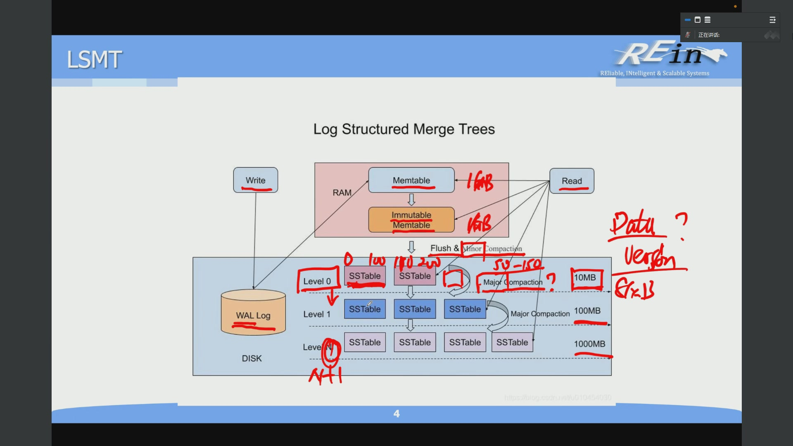

**双内存表机制**确保在一个内存表写满时，它的角色会切换成`Immutable Memtable`（即冻结），然后另一个内存表可以立即接收新的写入（写操作不能停止，系统需要持续接受新的数据写入）。此外，满的内存表需要被持久化到硬盘，以释放内存空间供新的写入使用。这个过程需要一定的时间，不可避免会有写入延迟。将满的内存表**冻结**，即转换为不可修改状态，能确保数据的一致性和完整性。

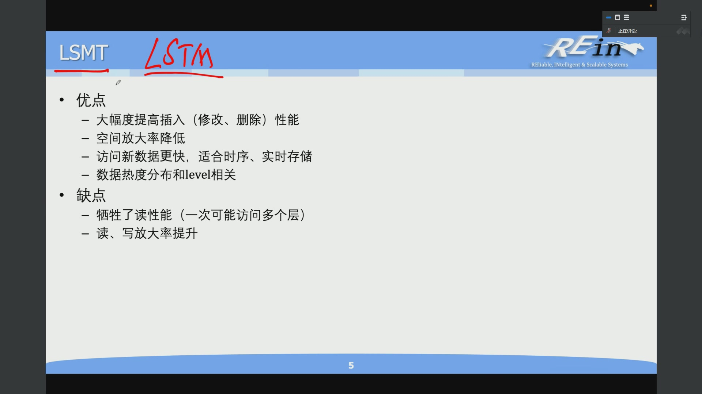

#### 2.2 SSTable(Sorted String Table)

**SSTable的特点**

- 存储的是<键,值>格式的字节数据 
- 字节数据的长度随意，没有限制 
- 数据顺序写入
- 键可以重复，键值对不需要对齐（所以需要一个索引记录key和offset）
- 随机读取操作非常高效

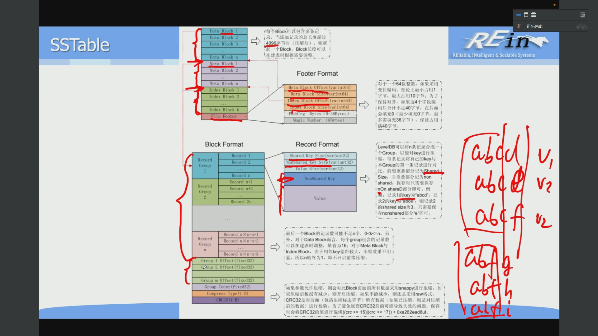

**SSTable的限制**

- 一旦SSTable写入硬盘后，就是不可变的，因为插入或者删除需要对SSTable文件进行大量的I/O操作 
- 不适合随机读取和写入，因为效率很低，原因同上一条

#### 2.3 写放大问题

- 写入的时候可能有个阻塞问题，为啥？因为它写入的时候有可能需要去做合并Compaction，比如L0层满了之后，它要往L1层去落，那么刚才讲了一个极端情况是L1层你落下来之后也满了，又要往L2层落，以此类推，每一层可能都会满。不断地往下compact导致**实际写入的数据量远大于真正的数据量**。

#### 2.4 读放大问题

- 那读呢？是存在这么一个问题，就是我在找一个数据的时候，我先到内存表里；找不到，我再到这个 L0层找，找不到我也不能说这数据不存在，有可能它太老，它落到底下去了，于是我一层层找，极有可能就是最后你在很找了很多层你才找到。而且你在不同的层里面可能还存着不同的版本。因为我们刚才说了，它的改写是通过append追加得到的，那也就是说你如果有老版本的话，它会在更低的层里面，如果没有经过compaction，这个数据还是在的，只有compact才有一次机会可能把它给删掉。这个过程可能需要不止一次I/O。特别是range query的情况，影响很明显。**限制了AP查询的性能**。
- 优化：同样可以用一个布隆过滤器

#### 2.5 RocksDB

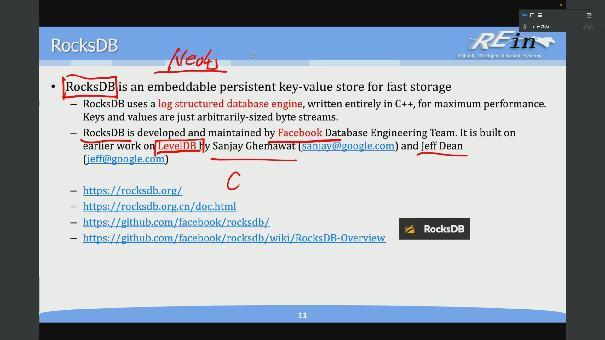

和Neo4j类似，有两种运行方式：一种是他在后台作为一种服务，另一是它嵌入到应用中

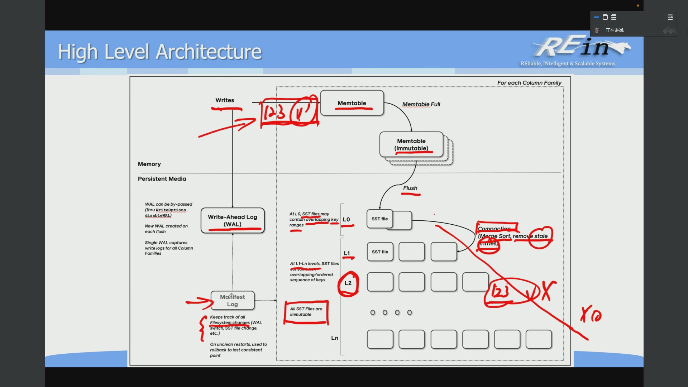

**注意的点：**

- 在写之前，同样要先写Write Ahead Log
- 有多个Immutable Memtable，因为写操作数量比较多
- L0层是允许key的范围有重叠，从L1之后往下不允许范围有重叠
- Compaction过程中可以去掉旧数据
- Manifest Log不断追踪文件系统的变化，相当于记录SSTable的变化

课上运行了一个**嵌入式**的RocksDB的Java程序，要注意的是在实现增、删、查方法时需要添加**synchronized**关键词，防止多个用户访问时出错，比如一个正在删，一个正在查

#### 2.6 HTAP(Hybrid Transactional/Analytical Processing)

- 数据存储方式的选择（按行存储 vs 按列存储）直接影响数据库对不同类型工作负载的支持。

##### 行存储与列存储的区别

- 行存储:数据以“行”为单位存储，每一行包含一个完整的记录。

	适用于:在线事务处理（OLTP）

	- 低延迟、高并发的随机读写操作。
	- 典型场景：订单处理、用户登录等。

	- 优点:
		- 快速插入和更新单条记录。
		- 适合频繁的随机访问。
	- 缺点:
		- 大规模的顺序读取（如统计分析）效率低下。

- 列存储：数据以“列”为单位存储，每一列的数据集中存放。

	适用于:在线分析处理（OLAP）

	- 高效的大规模数据读取和聚合操作。
	- 典型场景：销售统计、报表生成等。

	- 优点：
		- 高效的列级压缩和大规模数据读取。
		- 适合大规模顺序访问和分析。
	- 缺点：
		- 插入和更新单条记录较慢，尤其是高并发场景。

##### OLTP与OLAP对存储格式的不同需求

- 在线事务处理（OLTP）
	- 特点：
		- 高并发、低延迟的随机读写。
		- 处理大量短小的事务（如订单、用户信息）。
	- 需求：
		- 快速的单条记录插入和更新。
		- 高效的随机访问支持。
- 在线分析处理（OLAP）
	- 特点：
		- 低并发、高吞吐量的大规模数据分析。
		- 处理复杂的查询和聚合操作。
	- 需求：
		- 高效的顺序读取和列级聚合。
		- 优化的列存储以提升查询性能。

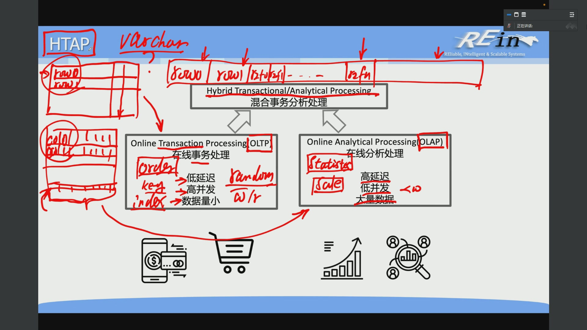

##### 混合存储的挑战

- 不同需求的冲突：OLTP和OLAP对存储格式的需求相互矛盾，单一的存储格式难以兼顾两者的性能。
- 系统复杂性：在一个系统中同时支持行存和列存需要复杂的存储管理和数据一致性维护。

##### 解决方案

1. **双存储方案（Dual Storage）**：
	- 同时维护行存和列存两份数据。
	- 优点：
		- 完全优化 OLTP 和 OLAP 各自的性能。
	- 缺点：
		- 存储空间浪费严重（数据存储空间翻倍）。
		- 保持两份数据的**一致性**极为复杂，易出现数据不一致问题。
2. **根据数据的访问情况进行行存和列存的自动转换**

RocksDB没法直接实现行存到列存的转换，但他走了一个`折中路线`

##### RocksDB 的处理方式

- 列族（Column Family）
	- 很多NoSQL数据库都想到这种方法，很像MySQL的`垂直分区`（但是MySQL自身不支持，因为维护起来太麻烦，找第三方工具能实现），而在NoSQL中垂直分区是很常见的
	- 将数据分成不同的列族，每个列族独立管理和优化。
	- 例如，订单表中将与 `sale` 相关的列存储在一个列族中，以优化OLAP查询。
	- 其他订单相关信息继续使用行存列族，优化OLTP操作。
- 预写日志（WAL）
	- 所有列族共享一个预写日志和Manifest Files，确保数据一致性和可靠性。
- 优化折中
	- 通过垂直分区和列族机制，实现部分行存和列存的优化，兼顾OLTP和OLAP的需求。

#### 2.7 RocksDB的读写流程

##### 2.7.1 写流程

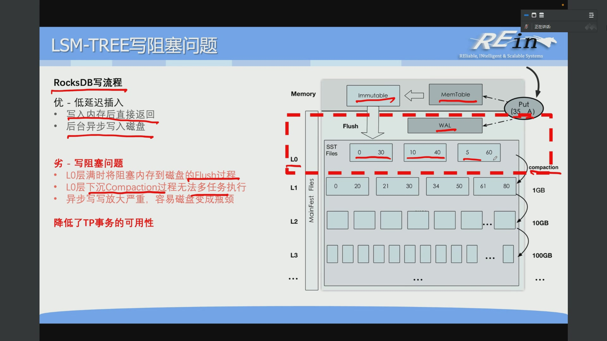

**解决：**

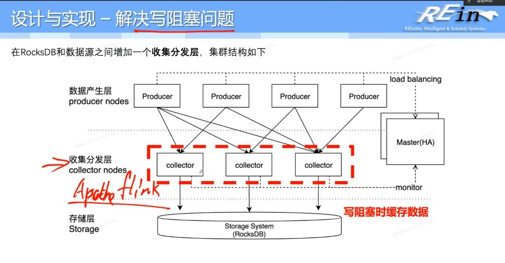

增加一个**收集分发层**，比如**Apache Flink**（一种流处理框架，广泛应用于字节跳动、阿里巴巴等大型平台，用于高效处理和分配数据）

###### 数据处理流程

1. 数据接入：数据首先接入Flink进行实时处理和分发。
2. 数据暂存与分配：
	- 确保大量数据能够被快速接收和暂存（写阻塞是缓存数据）
	- 将数据根据策略分配到不同的Collector进行后续处理。
3. 数据写入存储系统：Collector负责将数据从内存写入硬盘，确保数据的持久化存储。

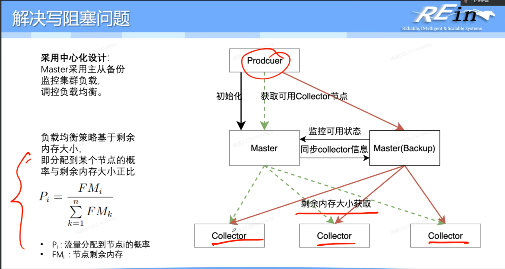

###### Collector管理与监控

- 多Collector并行写入：系统中存在多个Collector，能够并行处理写入请求，提升写入效率。
- 监控Collector状态：
	- 关键监控指标：
		- **内存大小**：每个Collector的总内存容量。
		- **剩余内存**：当前Collector的可用内存量。
		- **写入进度**：数据写入到内存和从内存落盘的进度。
	- 监控目的：实时了解各Collector的负载情况，确保数据分配的合理性。

###### 数据分配策略

- 动态分配策略
	- 根据内存使用情况分配：优先将新数据分配给空闲内存最多的Collector，以优化资源利用。
	- 负载均衡：确保各Collector之间的负载均衡，避免某些Collector过载而导致写阻塞。
- 具体步骤：
	1. 检测Collector状态：实时监控各Collector的内存使用情况和写入进度。
	2. 选择合适的Collector：根据空闲内存量，选择最合适的Collector接收新的Producer数据。
	3. 分配数据：将数据发送到选定的Collector，确保写入操作的高效和连续性。

###### 优势

- 避免写阻塞：通过合理的数据分配，减少单个Collector的压力，避免写操作被阻塞。
- 提升系统可用性：保证写入操作的连续性和高效性，提高事务处理的可用性和系统响应速度。
- 增强系统扩展性：过增加Collector数量，可以线性扩展系统的写入能力，适应更高的并发写入需求。

##### 2.7.2 读流程

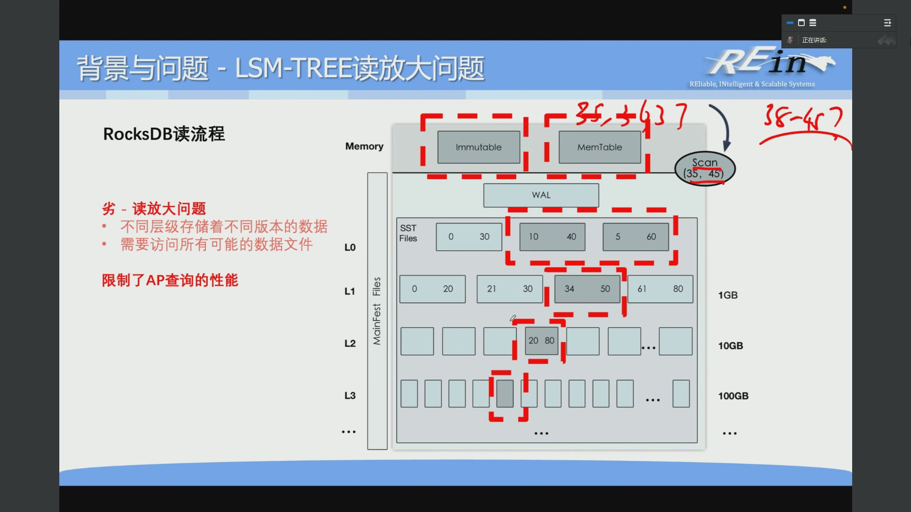

**解决：**

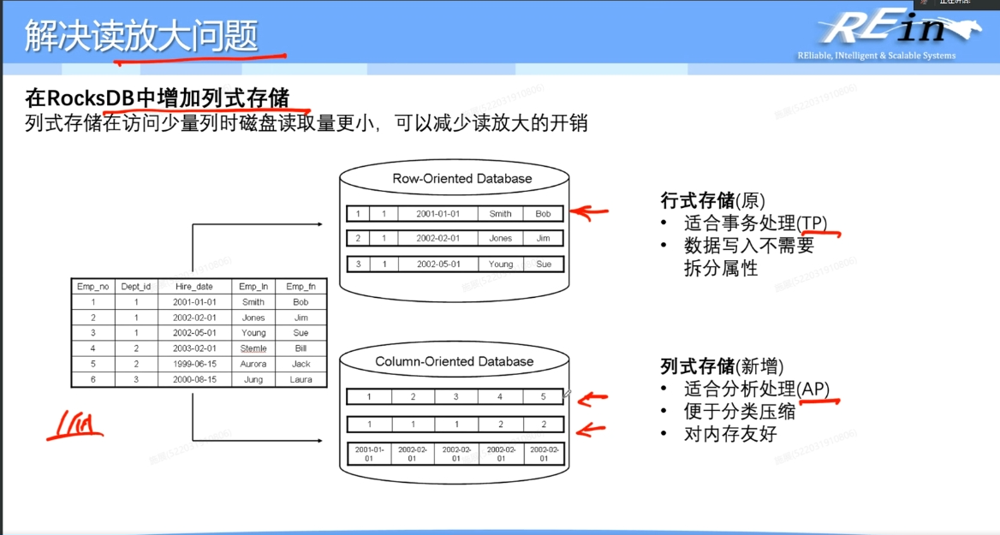

###### 列存储在RocksDB中采用分块存储策略：

- 数据量较大时（如100万条记录），不能先全部存这100万跳记录的某一列，然后在存下一列。
- 分块存储策略：
	- 将数据按列分成多个数据块，每个数据块包含前m行的某一列数据。
	- 每个大块内先存储第一列的数据，接着存储第二列，依此类推。
	- 数据块按行切分，确保在每个大块内按列存储，提升查询效率。

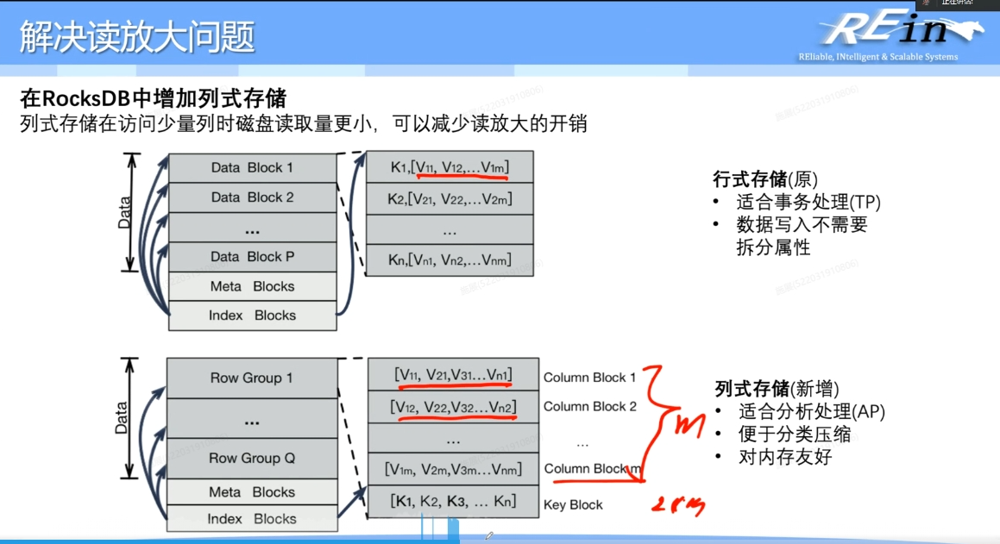

###### 支持混合存储策略：

- 支持同时使用行存和列存，满足OLTP和OLAP的不同需求。

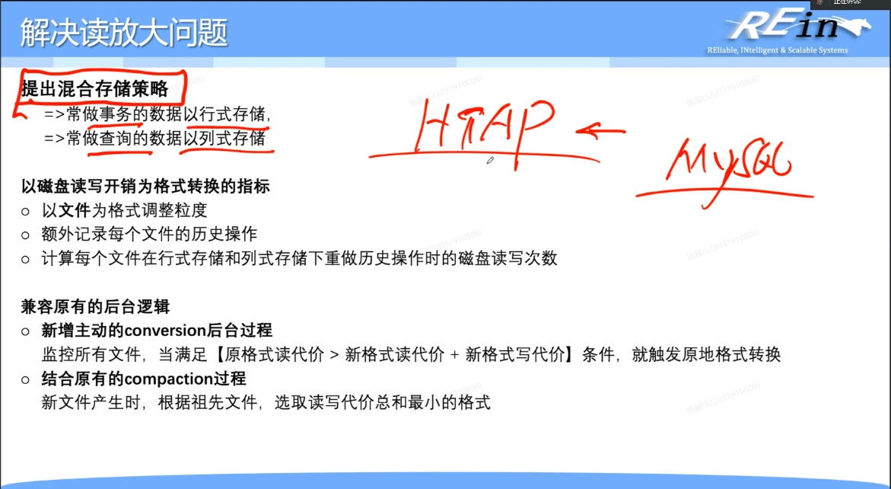

几乎所有数据库都支持HTAP功能（包括MySQL），用户可以选择打不打开，但是打开之后会影响性能

#### 2.8 HTAP系统整合

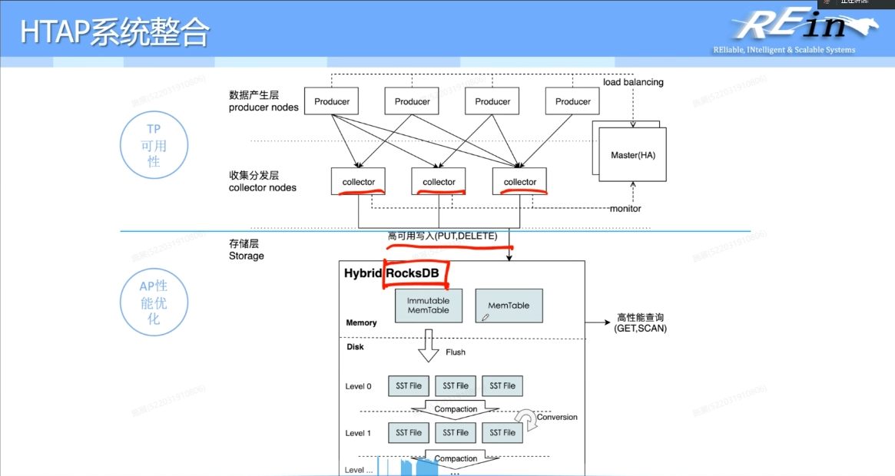

根据发送过来的请求来决定是在行存还是列存上去做操作。行存和列存是在**互相转换**的，不需要在任何时刻两个同时存在，数据在行存和列存上做转换，只保留一份。

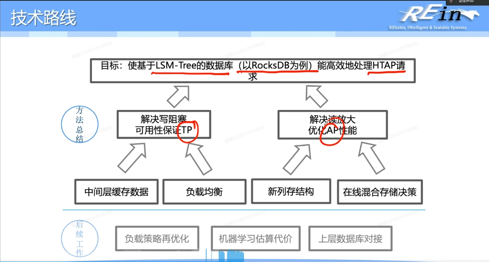

我们只是以RocksDB为例来讲了为什么数据库中需要行存和列存来支持HTAP，事实上，关系型数据库、文档数据库等也都是同时支持AP和TP的。

### 3. Vector Database向量数据库

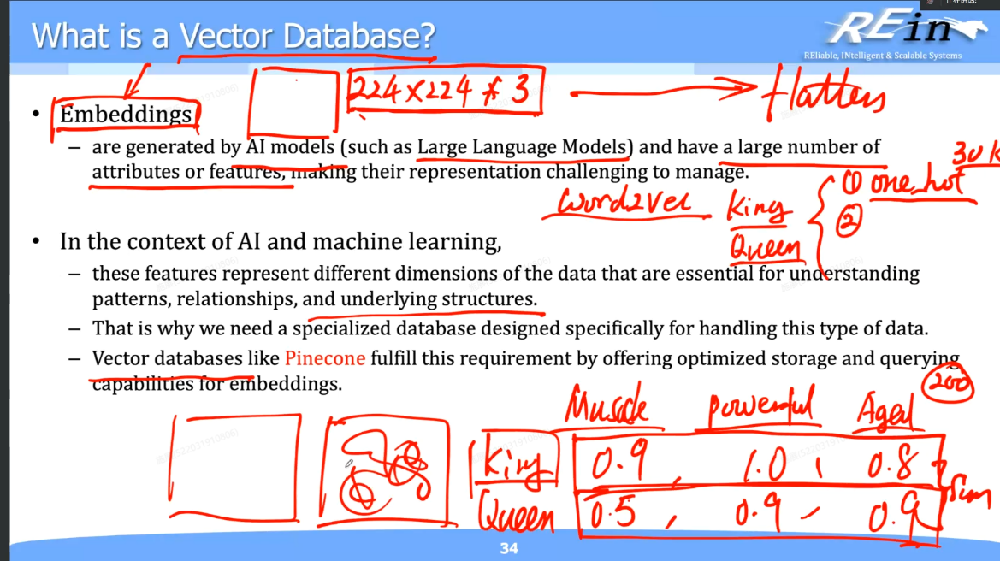

#### 3.1 定义：

专门用于存储和查询高维向量（嵌入）的数据库，主要用于支持人工智能模型中的相似性搜索。

#### 3.2 向量数据库解决的问题：

###### AI模型中的嵌入需求

- 嵌入（Embedding）

	- 将目标对象（如文本、图像、视频）数值化，转化为高维向量。
	- 生成的向量包含对象的特征或属性信息。

- 应用场景：

	- **图像分类**：将图像像素（如224x224像素*3通道）摊平成一维向量作为嵌入。

	- **自然语言处理**：将单词通过词向量模型（如Word2Vec）转换为向量表示。

		- 使用One-Hot编码：每个单词表示为一个稀疏高维向量，维度等于词汇表大小（如3万个单词）。单词a在第一个位置上为1其他位置都是0，单词b在第二个位置上为1其他位置都是0（需要3万个位来表示）

		- 缺点：
			- 维度过高，存储空间大。
			- 向量之间正交，无法表示单词间的**相似性**。

	- **降维嵌入**：

		- 将单词嵌入压缩到较低维度（如上图中的5维，每一位代表一种“属性”）。
		- 优点：
			- 降低存储空间需求。
			- 向量之间可以计算相似性，反映单词间的关系。

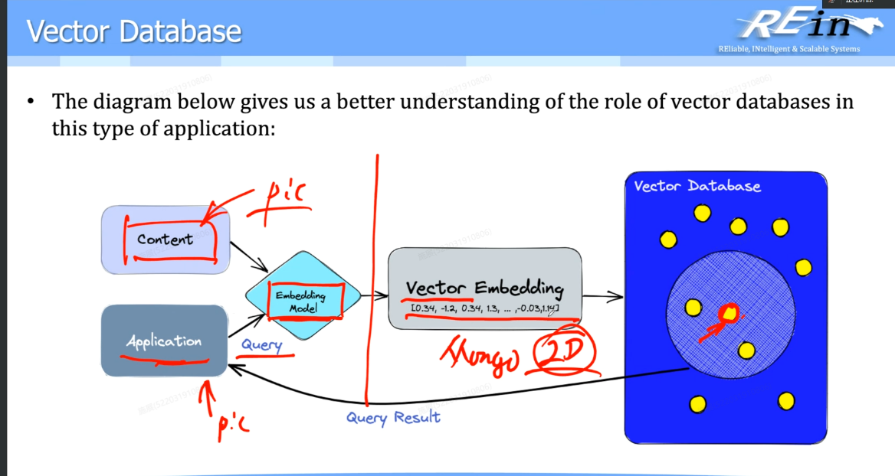

#### 3.3 向量数据库的工作原理：

###### 存储向量

- 存储内容：向量数据库存储各种对象的嵌入向量。
- 相似性搜索：根据查询向量，查找数据库中与之最相近的向量，支持相似对象的检索。

###### 向量与传统数据库的区别

- 传统数据库：主要支持精确匹配查询。
- 向量数据库：支持基于向量相似度的模糊匹配查询。

###### 常见相似度度量

- 余弦相似度（Cosine Similarity）：
	- 计算两个向量的夹角余弦值，范围[-1, 1]。
	- 越接近1，表示向量方向越相近。
- 欧几里得距离（Euclidean Distance）：计算两个向量之间的直线距离(用两点之间距离公式)。
- 曼哈顿距离（Manhattan Distance）：计算两个向量在各维度上的绝对差值之和。
- 其他相似度度量：Jaccard相似度、Hamming距离等，根据具体应用选择。

#### 3.4 向量数据库的索引方法

###### 维度处理

- 高维向量的挑战：存储空间大，查询效率低（之前的例子，一张图片变成向量会有224 * 224 * 3位）

- 降维方法：

	- 随机投影：
		- 使用随机矩阵将高维向量投影到低维空间。（1 * n的向量乘n * m的矩阵变成1 * m）
		- 当然也可以从低维变成高维，所以本质上是**维度的压缩或扩张**

	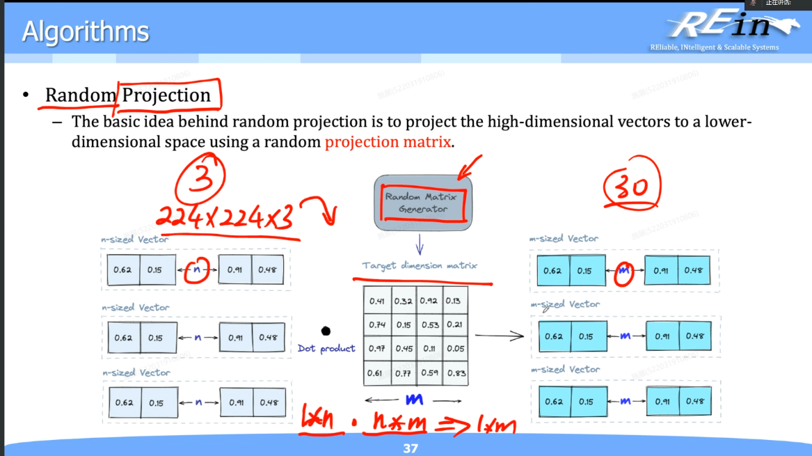

	- 量化（Product Quantization）：
		- 将高维向量拆分成小块，映射到预定义的代码本（Codebook）中，减少存储空间。
		- 本质上是做了一个**聚类**操作
		- 如下图所示，如果A和B经过分割然后量化后都有3个code，可通过比较匹配上的有多少个，匹配的越多表明越相似

	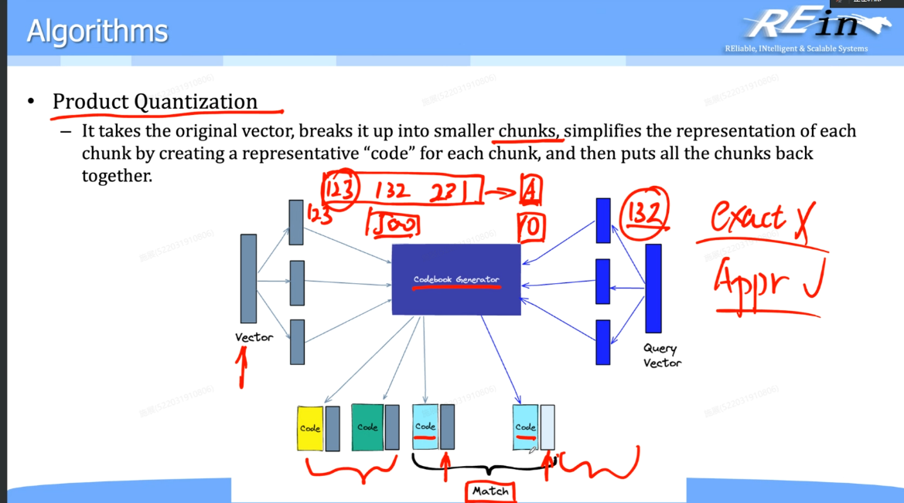

###### 其他计算近似的算法

- 位置敏感敏感哈希（Locality-sensitive hashing）
	- 相似的向量会进入同一个哈希桶且位置靠近（如下图所示）

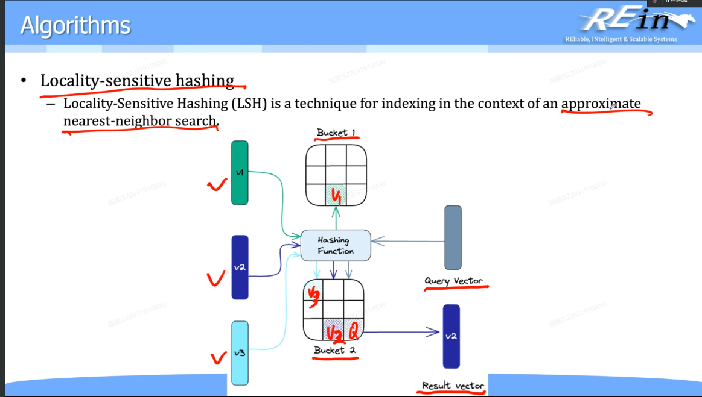

- 图结构方法
	- 层次化可导航小世界（HNSW）：构建多层次的图结构，每个节点（代表一个“群”，群内的向量相似度都比较高）连接相似的节点，支持高效的近邻搜索。

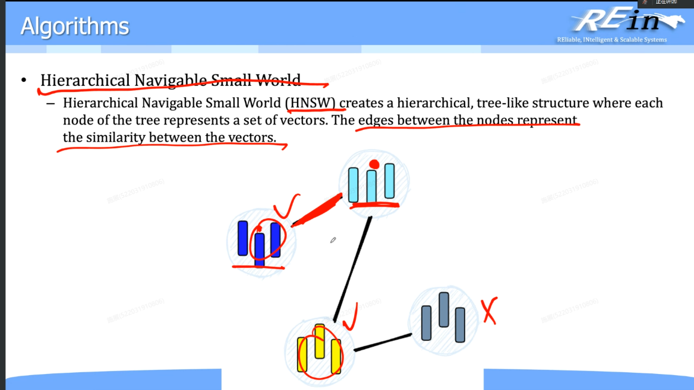

###### 通过过滤来优化

一个向量包含着元数据（比如图片信息，视频信息和音频信息）

在进行相似度查找时，有两种过滤方式：

- Pre-filtering：先把不相关的过滤掉（比如我只想找相似的图片，那我就先过滤掉视频和音频），再根据相似度排序
- Post-filtering：比如是多模态的搜索，然后对结果进行过滤，如果不满意过滤后的结果还可以退回到初始的结果进行进一步处理

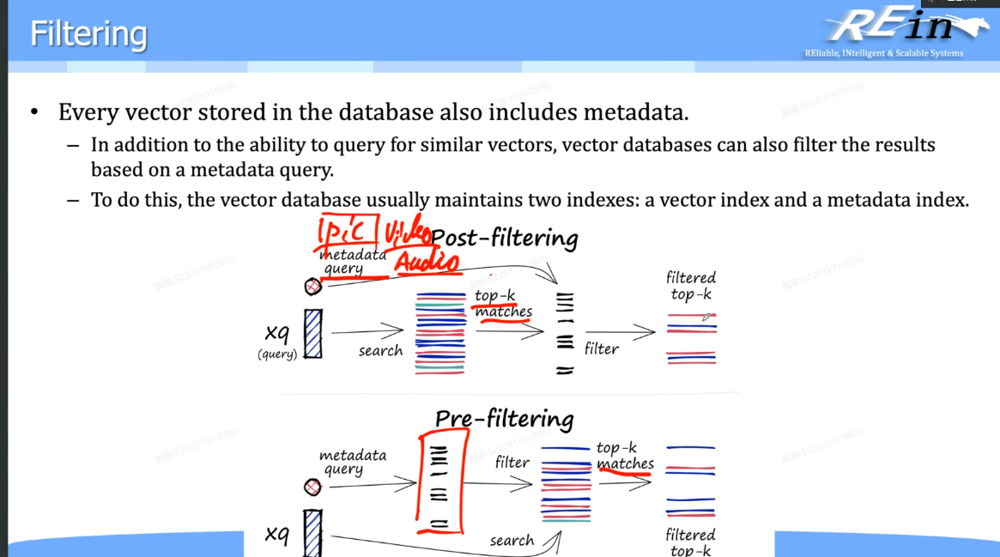

#### 3.5 以Pinecone这个向量数据库为例

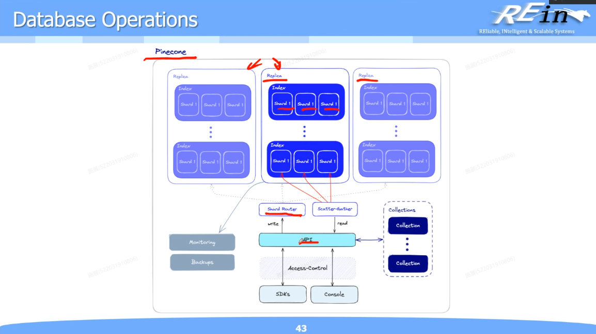

可以发现，它也有**主从备份**，然后它存的是**索引Index**，可以理解成传统关系数据库的表(Table)。每个Index在Pinecone中都是一个独立的数据结构,用于存储和检索高维向量。创建索引时，需要定义`向量维度`和`相似度的度量方式（比如余弦相似度）`。此外，索引中有**sharding分片**

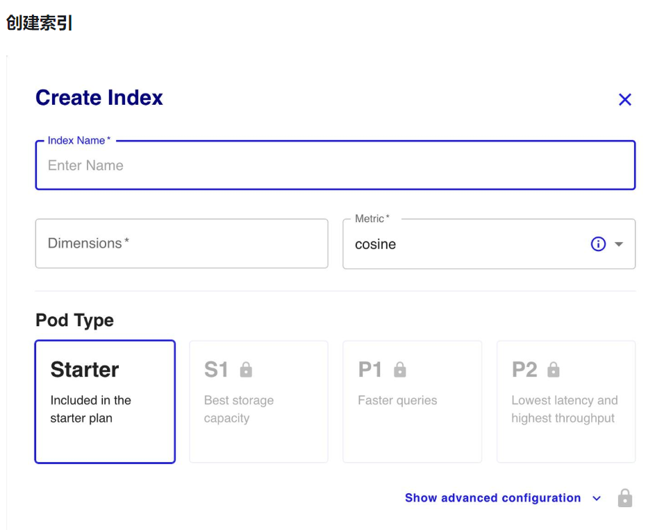

- 在创建完索引后，可以将嵌入向量插入到索引中（相当于往表中插入一条数据），也可以进行删除操作。

- 查找时，输入查询向量，可以获取Top K相似向量及其对应的对象。

- 下图的示例是针对三维向量的query，返回结果中的**score**表示相似程度，越大表明越相似。

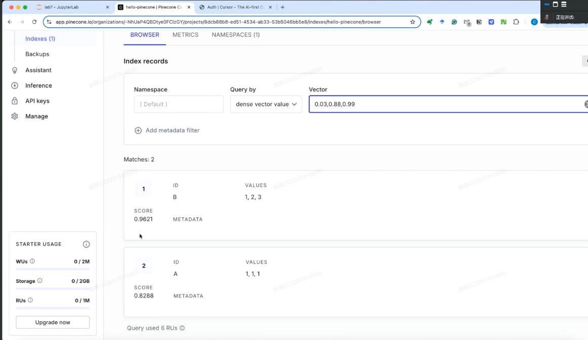