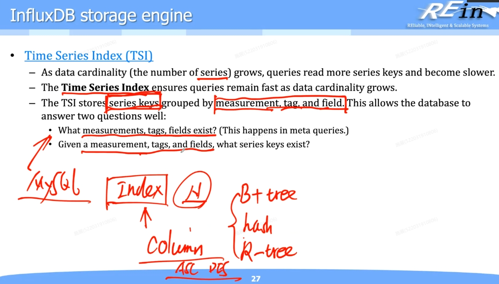

## 18章 Timeseries Database 时序数据库

### 1. 概念

时间序列数据库（TSDB）是针对时间戳或时间序列数据而优化的数据库。

> 时序数据：比如说一个花园，我在里面布了很多的传感器，这些传感器能检测温度和湿度，我来做这个自动浇灌，然后他们就会源源不断的产生数据，我要把它存起来，那可以看到它们源源不断产生数据，于是我们看到这数据有几个特征。
>
> - 第一个：它的**数据格式是比较简单**的，不像关系型数据库有多个表然后表和表之间还有关联，它实际上就是一**些监控数据**，比如温度，资源利用率utility
> - 第二个：因为格式比较简单，因此可以**不存原值，存差值**。比如有一串温度数据11.1，11.2，10.9，10.8，可以保存成11.1，+0.1，-0.2，-0.3，这样做的好处是可以**节省空间**
> - 第三个：这个数据只要你往上发，它一定**带一个时间戳timestamp**。针对timestamp的存储可以做**优化**，比如我要存13位的学号，前10位所有人都是一样的，那么前10位可以只存一次。timestamp同理，可能很多数据timestamp一样，那么可以之存一次。此外，也可以像第二点一样，存差值，节省空间。
> - 第二个：你一定会有大量的这种传感器在传数据，所以它必须要支持这种**高并发**，就**吞吐量要大**，这种吞吐量必须要大才能支持高并发。
> - 第四个：你说传感器如果他在报数据，他偶尔丢掉一两个或者一两个不太准，它会不会影响你的这个数据整体的效果？
> 	就是他如果说每一秒钟都报一个数据，在某一秒他突然丢了一个数据，它会不会影响你做统计的效果？就理论上来说，它里面的**数据允许少量的不准确或者是缺失**，也就是说它的数据和那种 transaction 的数据就形成了鲜明的对比。
> - 第五个：就是其实我们**对单点的数据是不感兴趣**的，你说我要知道某一个时间点，这里面每一秒都要发数据，我要知道在某一秒的数据，这个肯定你不太关心，你关心的是**一个时间区间内**，比如说在一小时内它的数据什么样的，我要去求和，更严谨的说第五个：它的**数据格式是比较简单**的，不像关系型数据库有多个表然后表和表之间还有关联，它实际上就是一**些监控数据**，比如温度，资源利用率utility
> - 第六个：因为格式比较简单，因此可以**不存原值，存差值**。比如有一串温度数据11.1，11.2，10.9，10.8，可以保存成11.1，+0.1，-0.2，-0.3，这样做的好处是可以**节省空间**。所以在持续数据库里，他对单点数据的访问不会特别多，他经常做的是对一块数据，尤其是时间片划分出来的一段数据，他要去做一个访问。

1. 整体的存放是用了类似lsm日志结构合并树的结构；时序数据库的**生命周期一般比较短**，比如一个传感器，可能我们只关心最近一周的或者一个月的数据，超过的时间的数据就可以删除（比如当掉到L0以下，我们就将其压缩，甚至删除）。（类比关系型数据库的订单数据，订单数据必须要持久化保存，但是这种时序数据库可以**通过摘要压缩一下，或者直接删掉**）
2. 不太可能会建立索引，例如记录温度随时间的变化，一般不会有必要建立索引（比如建个温度在时间的索引，这没有意义）
3. 对于时序数据库接受的数据的特点：格式简单，更多的数据点，更多的数据源，更多的监控，更多的控制

> **Telegraf & InfluxDB**
> InfluxDB是数据库；Telegraf是数据采集器，可以采集各种各样的数据，然后把数据写入到InfluxDB里面去。

### 2. InfluxDB

#### 2.1 query示例：

#### 2.2 基本概念

- Bucket就是类似于关系型数据库中“表”的概念；没有库的概念，因为不像关系型数据库中有外键关联的概念。
- 带有_开头的，都是系统保留的字段，也就是一定会有的一个列，反之都是用户自定义的字段（比如上图中的location和scientist，他们都是**Tag key**, Tag可以作为筛选的依据，得到一个**Tag set**）。
- _time：时间戳，数据对应的时间，因为可能同一个时间会接收到很多数据，所以很可能同一个时间接收到很多数据，所以时间戳不能唯一的标识。时间戳非常准确，精确到纳秒级别。
- _measurement：起一个名字，一个统称，这个表格在干啥。census就是调查种群数量。这里我们发现它是共享的，所以存储的时候会优化，**只存储一次**。
- _field：存储的是key，比如上图里面存储的就是某个物种的名字；和value构成键值对。Field可以作为筛选的依据，得到一个**Field set**。
- _value：存储的是value，类型可以是strings, floats, integers, or booleans，之所以不能是别的，是因为如果是复杂的数据类型转换会耽误时间，效率降低，所以就只能存这些基础的数据类型。
- 所有的tag都参与索引，而field是不参与索引的（从语义上说，tag的东西都是用来“修饰”_field的，比如上图中的）

#### 2.2 Schema优化

上图中，location和scientist都属于Tag，_field和 _value都是Field。Tag和Field之间是**可以相互转化**的

- **Fields不参与索引**，必须扫描全表；如果经常被访问，就表明不适合以这种形式存储，就应该以Tag的形式存储。
- **Tags参与索引**，当然查询起来就会更快。当然索引本身是有开销的，并且如果你进行写操作，索引也会更新，带来更多开销。

考虑以下的示例：

如果经常会做上述的query，那么事实上我们不用每次都去做全表的scan。如果在bees这一列上**按value的值做过索引**，那么query会更快。修改下图所示

#### 2.3 influx中的其他基本概念

- Series：measurement, tag set, 和field key都相同的点集合，统称为series key。

- Point：一个数据点，带有时间戳的数据点。
	比如 `2019-08-18T00:00:00Z census ants 30 portland mullen`
- Bucket：存储桶，包含**数据库**和**存活时间（retention period，即每个数据点能持久化存在的时间，时间一过就会删除掉）**这两个概念。归属于一个组织，存储相对应的数据点集合。
- Organization：组织，一组用户共同的工作空间，他们会看到相同的bucket，dashboard等。

#### 2.4 InfluxDB设计原则：何以支持时序数据？

- **严格按照时间组织**，按照时间顺序递增追加append（write in time-ascending order），不会出现说我突然插入一个以前的时间戳
- **严格限制update和delete**。首先本来就是传感器送过来的数据，你改它干吗？而且，你明明一直在追加，你说我往里面去改写，那它就不是顺序读了，它要做一次随机读，它效率就降低了。改一下有可能尺寸会发生变化，要么留下空洞，要么它存不下后面东西所有都要往后挪，所以它就严格限制你不能这么做。所以他认为时序数据就是新数据，而不是一个数据的不同版本（所以和RocksDB有差别）。
- **数据的读写优先**。你数据库里就是读和写，然后你说他们优先，那还有啥东西？就是我们的数据库InfluxDB，那它也许会是分布式处存储的，那它可能一主两从，那你这些中间是不是就会有同步的问题？这是一个动作，这是他内部要去实现的，但是他就告诉你，如果你现在有这个读和写，就指的是用户发送过来的读和写的要求的话，必须优先处理，哪怕你没同步好也要处理。比如当数据的接入率非高的时候（multiple writes per ms），这个时候query会类似“冻结”一样，只把当前时间之前满足的数据返回给你，在执行过程中之后进来的数据是找不到的，因此**有可能找不到最新的数据**。它实现的是**最终一致性**，而不是实时一致性。因为它认为系统的实时性比较重要——开始我们讲过了，我们是允许时序数据中一些小小的错误的。
- **幂等性**。应用场景里面就是大量的传感器，会把大量的数据通过不可靠的或者不那么可靠的网络传递过来，那我就不能保证它没有被发送多次，但是它发送多次它也不能对我的数据库产生影响，我只存一个（根据时间戳）。比如除了value之外的部分数据都是相同的，这样的数据提交了三次，不会像MySQL一样插入三行相同的数据，InluxDB会用最新的一个数据存储。
- **没有传统意义上的ID**。因为数据集比单点数据更重要，id是来区分每一条数据和其他数据之间的差异，用ID是因为我们要拿单点数据，但对于时序数据库我们没有这一需求。所以InfluxDB实现了强大的工具来聚合数据和处理大型数据集。点通过时间戳和series key来区分，因此没有传统意义上的ID。

#### 2.5 Storage Engine 存储引擎

整体是TSM（Time Structured Merge Tree）结构，类似于LSM的结构。

###### 2.5.1 Writing data from API to disk

**关键概念：**

- **Line Protocol：**采用**Line Protocol**来将数据写入硬盘。它本质上可以视为一种“键值对 + 时间戳”格式。与JSON类似，但在序列化和传输时有特定的格式，旨在更高效地处理时序数据。之所以高效是因为InfluxDB提供了RESTful的HTTP接口来接收数据,通常使用`POST`方法提交数据到指定的写入端点（如 `/write`），数据在传输过程中以字符串（或类 JSON）形式封装，方便批量写入。
- **数据写入流程：**
	1. **客户端发送数据**
		- 通过`POST`请求将数据发送到InfluxDB，数据可包含一个或多个“点”（Points）。
		- **批量发送**：为降低网络和接口压力，通常会将多条数据（多个点）批量发送，而非单条单条发送。
	2. **接收数据与压缩**
		- InfluxDB接收数据后，会对相同或相似的部分进行简单压缩（如“相同数据只存一次，然后记录数据出现的范围”）。
		- **目的**：减少写入量，避免预写日志（WAL）迅速膨胀。
	3. **写入WAL（Write-Ahead Log）**
		- 数据在正式持久化到底层存储之前，会先写入**WAL**。
	4. **内存缓存（Cache）**
		- 查询可见性：只要数据到达Cache，便可被查询到（类似于前面介绍的 RocksDB/LSM Tree 的MemTable机制）。
		- 当Cache达到一定阈值或时间周期到达时，才会将数据 **刷新（Flush）**到硬盘。
	5. **持久化与 Compaction**
		- **多层存储（L0 ~ Ln）**
			- InfluxDB采用类似LSM Tree的结构，数据从内存落盘后会形成新的文件（如L0层文件）。
			- 随着数据量增多，文件会不断往更低层（L1、L2…Ln）合并，类似RocksDB的层级结构。
		- **Compaction（合并操作）**
			- 当某层文件数量过多或文件规模过大时，需要执行Compaction**将多个文件合并，删除或合并重复数据，生成更大、更有序的新文件。
			- 目的：减少文件数量、优化查询性能、回收无效空间。

###### 2.5.2 Write Ahead Log(Log)

**关键概念：**

- **顺序写入日志**

	- 当存储引擎接收到写请求后，首先将该请求写入预写日志（WAL）。

	- WAL采用顺序写的方式，将写操作记录（如新增或更新的数据）依次追加到日志文件中。

- **同步日志到硬盘**

	- 为确保数据可靠性，存储引擎会将预写日志刷新（Flush）到硬盘。

	- 只有当日志文件同步到硬盘之后，系统才认为该写操作有了“落盘保障”。

- **数据写入内存**
	- 日志同步完成后，存储引擎才将数据缓存到内存（通常是MemTable、Buffer Cache等），便于后续的快速读写和处理。

- **写操作完成**
	- 当WAL同步和数据入内存等关键步骤执行完毕后，存储引擎才向调用者返回“写操作完成”的确认。

###### 2.5.3 Cache

**关键概念：**

- **Cache 与 WAL 的关系**

	- 当写请求到来时，先将数据写入**WAL**（写之前可能先压缩），以减少对WAL的写入量和存储占用。

	- 随后，数据会被放入内存**Cache**中，方便快速访问与查询。

	- 在一定时间或空间阈值触发后，数据再从Cache合并落盘至底层文件。

- **Cache 中的数据组织**

	- **Series Key**：由**Measurement**、**Tag**以及**Field**等信息组成，标识了同一组数据在不同时间点的记录。

	- **按 Key 存储**：Cache以Series Key为单位组织数据，相同的Key会被汇总在一起。

	- **时间顺序排序**：在同一个Series Key下，数据按时间戳顺序排列，便于时序查询。

- **“热”数据特性**

	- **内存中不压缩**：Cache中的数据（最热的数据）为了保证快速读写，不进行压缩。

	- **快速访问**：由于在内存中，查询时对热数据的读取延迟极低。

	- **动态合并**：随着时间推移或数据增长，Cache中的数据会批量合并到更低层的持久化文件，腾出Cache空间。

- **合并流程（Compaction）**

	- **周期或阈值触发**：在达到设定条件（时间、空间）后，Cache中的数据被合并写回磁盘文件。

	- **RocksDB式分层**：底层文件采用类似LSM Tree的多层结构，通过合并操作（Compaction）维持数据有序并释放冗余空间。

	- **查询可用性**：在合并的过程中，Cache中以及合并后的文件都能持续支持查询请求。

###### 2.5.4 Time-Structured Merge Tree(TSM) & TSM files

**关键概念：**

- **文件层次与合并（Compaction）**

	- **多文件合并**
		- InfluxDB的底层文件在写满或定期触发时，会进行合并（Compaction）操作，将多个小文件重新整理、去重、压缩后合并为更大的文件。
		- **按时间或按Series Key范围** 划分文件，合并时也会考虑Series Key的分布以便有序存放。

	- **数据“冷热”分层**
		- **写入Cache的数据**：视为“热”数据，未压缩，便于快速读写；
		- **落盘文件**：视为“冷”数据，进行压缩以节省存储空间；合并后再以较大文件形式存储。

- **列式存储(Column-Oriented Storage)**

	- **为什么采用列式？**
		- **典型时序场景**：频繁对某个或几个Field（字段）做分析或聚合，需要对单列进行大规模顺序扫描（Scan）。
		- **顺序读性能更高**：列式存储将同一列的数据集中在一起，便于大块读取。

	- **数据组织方式**
		- **Series Key**：由Measurement、Tag、Field等信息组合而成，标识同一“系列”数据。
		- **同一Series Key内部**：按时间顺序排列数据；多条数据打包在同一文件块（Chunk）中，并采用列式格式存储。

- **压缩与 Delta 编码**

	- **差值（Delta）存储**
		- 为降低空间占用，对数值型数据（如CPU利用率）通常只存储相邻记录间的“差值”（Delta），而不是原始值。
		- 基准点 + 差值：
			1. 先记录一个基准值（如50%）
			2. 后续每次只存“与前一次记录的差值”（+1%、-2% 等）
			3. 定期刷新新的基准点，减少误差累积。
		- **优点**：显著减少存储空间占用；
		- **缺点**：查询任意时间点的数据时，需要先找到基准点，再累计所有差值才能复原。

	- **列式压缩**
		- 同列数据往往类型和分布相似，更易采用高效的编码方式（如前几位相同，所以只存后几位、或仅存变化量），从而进一步降低存储量。

- **与 SSTable 的对比**

	- **相似点**
		- **日志结构**：写操作先顺序追加，后续合并（Compaction）生成有序文件；
		- **共享前缀/共享字段**：只记录差异部分，节省存储空间；
		- **按Key排列、分块存储**：可快速定位Key范围，提升查询效率。

	- **差异点**
		- InfluxDB主要面向时序数据，列式存储、Delta 编码尤为常见；
		- 一些传统的SSTable仍以行式或前缀压缩为主，未必都做列式拆分。

###### 2.5.5 Time Series Index(TSI)

**关键概念：**

- **基于 Series Key 的索引**

	- **Series Key**
		- 由Measurement、Tag、Field等组成，用于唯一标识一组时序数据。
		- TSI主要围绕Series Key构建索引，用来快速定位具体时序数据。

	- **索引结构简化**
		- 在传统关系型数据库中，索引种类繁多（B+树、哈希、前缀索引、地理空间索引等），可自定义多列、多种排序方式。
		- 时序数据库（TSDB）则不需要如此复杂的索引结构：
			1. 时序数据查询模式相对固定，多基于 (Measurement + Tag + Field) 的组合。额外索引（如多列任意组合）意义不大，且会增加索引维护成本。
			2. **只需维护Series Key索引** 即可快速查到相应的时间序列。

- **查询过程示例**
	- 指定 Measurement、特定 Tag 或若干 Tag、以及需要读取的 Field。
	- InfluxDB 通过 TSI，先找到满足 (Measurement + Tag + Field) 的 **Series Key**，再返回对应时间序列。

- **对比关系型数据库索引**

	- 关系型中的灵活索引
		- 可以任意指定单列、多列、前缀、顺序等，甚至支持空间索引。
		- 查询模式更加多变，需要更通用的索引策略。

	- TSDB 的简化模式
		- 查询模式围绕时序和少数固定字段，索引只需简单且高效地支持 (Measurement + Tag + Field + Time)。
		- 数据库内核也无需维护大量复杂的索引结构。

#### 2.6 InfluxDB file system layout

#### 2.7 InfluxDB shards and shard group

**关键概念：**

- **Shard 与 Shard Group 的定义**

	- Shard：
		- 时序数据在硬盘上的基本存储单位，通常已经经过压缩和编码。

	- **Shard Group：**
		- 对特定时间范围的数据进行分组管理的逻辑单位。
		- 例如，可将**1 天**定义为一个 Shard Group，再细分出若干个Shard（企业版）；在OSS中，每个Shard Group仅包含一个 Shard。

- **时间范围（Duration）的配置**

	- Retention Policy（保留策略）
		- 指定数据保留的总时长，例如保留4天的数据，超过4天自动删除。
		- 也可设置为 “forever” 不自动删除，具体视业务需求。

	- Shard Group Duration

		- 例如，可将 “1 天” 作为一个 Shard Group 的持续时长；在此之下再根据需要划分 Shard（如1小时一个 Shard）。

		

		- 当新的时间段开始时，自动创建新的Shard Group并删除过期的旧Shard Group（由 Retention Policy 决定）。
		- **Precreation（预创建）**：可提前创建未来时间范围内的Shard Group，避免在数据刚到来时再去建Shard Group耗时。

	

- **数据“冷热”分层与写入流程**

	- 最新写入的数据
		- 位于内存缓存（热数据）或刚创建的Shard（活跃 Shard），此时往往尚未压缩，利于快速写入和读。

	- 压缩与落盘
		- 当 Shard 不再是活跃状态，数据落盘后会进行更强的压缩（TSM 文件），减少存储空间占用。
		- 落盘后的 Shard 即可视为相对“冷”的数据，未来只读不写，便于在时间到达后直接删除。

	- Compaction（合并）
		- 采用类似 LSM Tree 的多层结构（L0/L1/L2/...），数据批量往下合并，减少文件数量并整理数据。
		- 每一层比上一层存储容量可大一个数量级，默认配到 L4、L5 即可满足相当大的数据规模。

	

- 自动管理与删除机制

	- 自动删除旧 Shard
		- InfluxDB 会根据 Retention Policy **周期性地**删除过期的 Shard Group，无需人工干预。
		- 例如，保留 4 天的数据：当第 5 天开始时，创建新 Shard Group 的同时，删除第 1 天的 Shard Group。

- 与传统数据库的区别

	- 传统数据库通常需要用户手动指定何时删除或归档数据；

	- InfluxDB 面向时序场景，系统自动完成旧数据的删除和新Shard Group的创建（都在配置文件中设置）。

