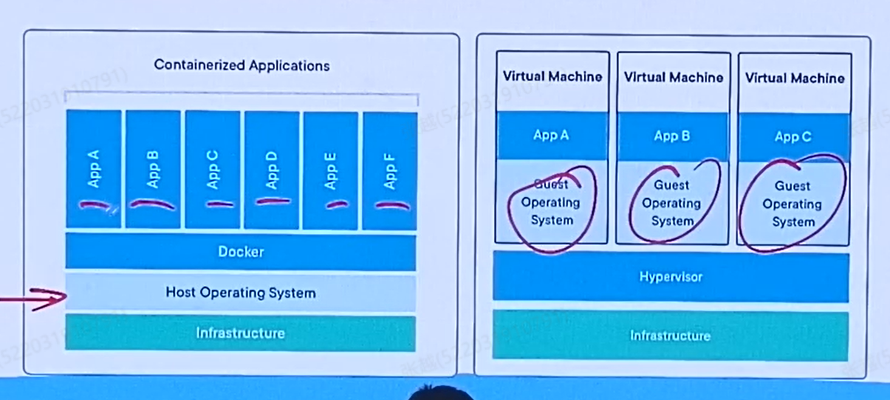

# 23. Vitualization & Container & CNN神经网络
## 23.1 容器
### 23.1.1 容器的设计原则（不重要）
容器本身是有一个设计的原则的--容器调研的PPT，总的来说容器是用Linux里面Cgroup2做的性能隔离。容器本身超过课程的范围，
来讲一下容器是怎么开发的。

### 23.1.2 容器是什么
        容器是什么，刚刚提到的就是用Linux中的Cgroups和文件系统中的namespaces命名规则，做的一个运行环境的隔离。
在运行的时候我们需要一个Runnable的image的实例，这个image就是对整个运行环境做了一个打包。

Image里面就包含了我们所有运行的一个环境。（A Running container uses an isolated filesystem）Cgroup之间就隔离开了，就要保证
A的容器和B的容器他俩的空间要完全隔离开的，我对A的任何操作，就不应该影响对B的任何操作。本质上这个隔离就是靠Cgroups实现的。

容器里有什么？ 其实就是所有运行我们环境所需要的依赖（dependencies),Configurations，binaries。所以容器之间有大小差异。

        Docker使用GO语言写的。总的概念就是我们用namespace去给所有的容器加一个前缀，然后Cgroup语句把容器彼此之间隔离开。

### 23.1.3 容器和虚拟机的区别

虚拟机内部是一个完整的OS，但是在容器里面，它实际上实在一个Linux的一个宿主机上面跑一个个的容器。这些容器在运行的时候，我们要考虑容器它是
分层的。 

        容器分层的目的是什么呢？比如我们开一个Springboot的项目，然后别人开发一个C#的项目，这些项目可能要依赖于底下一些共同的部分。
    于是这些共同的部分可以专门打包成一个Layer层。所以这些容器就可以变成若干层累积起来了。所以Docker内部是一个分层的结构。

所以我们科学上网，pull一个镜像的时候，我们可以看到镜像是一层层下载的，考虑分层的目的就是要做复用。就是有很多相同的东西
，不同的容器可以共享一层，这一层的代码就不用反复去拉取了，提高效率。

      虚拟机和容器最大的区别就是虚拟机有一个独立的操作系统。
这个完整独立的操作系统就可以告诉你，假如使用Windows的环境里面运行一个
Linux环境的虚拟机。但是Docker就会想，既然都是Linux操作系统，那我们为什么不直接基于这个操作系统，然后彼此之间的环境隔离开就可以了。
    
        所以Docker其实是要跑在一个类Linux的操作环境里头。

### 23.1.4 Docker的架构

我们在client端主要命令就是比如docker build可以本地构建一个镜像，就可以把他推到一个注册表（DockerHub）里去。

我们也可以使用docker pull拉下来一个镜像，我们可以在镜像里面去实例化一个容器。

docker run就是去实际跑起来一个容器。

### 23.1.5 DockerFile

DockerFile在告诉你，这个Docker镜像里面有些什么东西，就比如我们在docker build的时候，就会读这个DockerFile的内容，这个内容就告诉我们
怎么去打包这个image。

### 23.1.6 Container Volumn（数据持久化）

我们是否可以在容器启动的过程中不断动态添加卷（Volumn）上去，这些卷可以存我们想要的东西。但就像我们做作业中遇到的问题，我们直接给容器外挂
一个卷，重启容器后，这个卷内的数据就会丢失，怎么持久化这个卷里面的数据？

    我们需要先建立一个卷，我们再次运行容器的时候，除了对端口进行映射之外我们还需要对卷进行映射，对这个容器外挂这个卷。因为将容器关了以后，我们的卷
    还在，重启容器的时候还会把这个卷挂载进去，数据就不会丢失。

再进一步，如果我们不想要把数据搞成一个卷，挂载到容器上，我想自己管理文件，放到自己电脑的文件夹里面，该怎么办？

    那我们就要使用Bind Mounts，Bind Mounts和Named Volumn的区别就是，Named Volumn的位置是由Docker来决定的，而Bind Mounts的
    位置我们可以自行决定。

### 23.1.7 多个容器间通信

多个容器间通信，首先我们需要让多个容器跑在同一个网络内部。

    容器只有在同一个网络中，彼此间才能通信。

所以我们得首先使用docker network create指令创建一个网络。然后在这个网络中运行后续这多个容器。

### 23.1.8 Docker Compose

对于多个容器，我们能不能把这些容器一次性全部提来，这就需要Docker compose，我们要使用.yaml文件，里面包含所有Services的名称，image名字，端口映射
，过载卷，镜像环境...

    写好docker——compose.yml后我们就可以通过docker compose up来一键提起所有的容器。

## 23.2 CNN 自然语言处理基础知识

### 23.2.1 自然语言处理简介

自然语言处理涉及到以下几个方面：

怎么把自然语言数值化：
1. word->vector：（NLP研究1领域2 ~ 应用3领域2），缺点：字符种类过多，我们要用到的数值就过多了。而且各单词间有关联，我们得把单词变成Vector，如果
简单的把每个单词和其他的单词的关联写成[0,0,..,1,...1,..0,0]类似的Vector，若有100000个单词、则维度也为100000，显然过高了。
2. BOW（词袋模型）：对于有哪些词语，我直接把它放到一个袋子中（Bag of Word),然后按照它们的顺序进行排序。

卷积: 多个相连单词间的关系

    CNN可以用来做自然语言处理，我多设几个卷积层、池化层，第一层卷积层检测多个相邻单词间的关系，第二层检测多个相邻词组间的关系，
    以此类推，慢慢的就可以变成一个完整的句子。

### 23.2.2 自然语言处理示例

首先我们要知道怎么分词，把文本数据所有单词分开——可以使用字典（都是一个一个的单词，包含权重和词性）。然后我们需要获得语料库（corpus），即我们用于训练的
文本数据，（课中的例子是许多的新闻合集），对这个语料进行分词预处理。对于分词后的结果我们对之进行数据清洗，（课中的例子过滤了极值，这里过滤了只出现一次的词，以及
所有语料中50%以上都出现的值）。构建BOW模型，把之前分词后的结果构建为词袋模型（词袋模型具体做什么——拿着字典到你的语句里面找，每个字符都做了多少次，他做了一个统计，
统计完之后他按照这些单词的ID的顺序排列）。然后用N—Gram构建Phrases模型，对词组进行处理。再后面做了一个主题分类，使用GenSim在BOW模型基础上构建LDA模型，
查看每个文本被分到不同主题的概率。

CNN怎么运用的。

    
    顺序模型（普通CNN）：我们在对文本进行训练时，我们kernel_size为n，则找n个单词间的关系。然后用MaxPool进行池化，再卷积，就可以进而得到n个词组间的关系，
    所以效果很好。

    优化模型（TextCNN）：在卷积和池化层后，我们对池化层1、池化层2、池化层n的结果进行了一个拼接，相当于我们把短，中，长句子的特征都拼接到了一起，
    然后拉平，dropout一下，准确率会大大提升。而且如果各句子彼此长度差别大，该模型效果一定更好。

    ChatGPT用的是RNN循环神经网络，RNN的结果会更好！RNN不仅可以做语言处理、还可以做文本生成。
