# 24 Hadoop & RNN模型

## 24.1 Hadoop

- ### 24.1.1 Hadoop简介

Hadoop是Apache的项目，主要就是提供一个分布式的计算环境，就包含了云操作系统里面的一些实现，具体就是要解答分布式计算环境里面怎么让大量机器
看起来就像单个服务器一样做计算，实际上是在做大集群计算。

Hadoop项目包含了以下模块：Hadoop Common——支持其他Hadoop模块的common utilities，
Hadoop Distributed File System（HDFS）——一个高并发处理数据的分布式文件系统，Hadoop YARN，Hadoop MapReduce——分布式作业调度；Hadoop
Ozone——数据存储（对象存储）等等

HDFS实际上不是一个从底端开始，需要格式化才能装的文件系统，实际上是在类Linux操作系统上加了一层。所以在Linux或者类Linux（比如Mac上可以直接跑这个程序），
HDFS内部一个file可以分成若干tablet以及block，这些block被真正存到文件系统中。为了提高可靠性，在分布式环境中，我们一般要加一个副本。

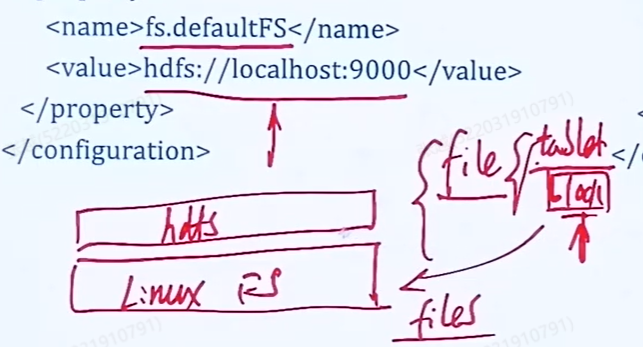

整个文件分区表存在namenode中，客户端每个请求先要进入namenode中，client->namenode->HDFS（block)->Linux FileSystem。所以打开hadoop首先要启动
namenode。

- ### 24.1.2 Map Reduce

Map: 如果一个A映射到B，如果A的长度是10，那么B的长度也是10，Map就是做一个集合映射。

Reduce： 把集合变成一个值，相当于一个规约。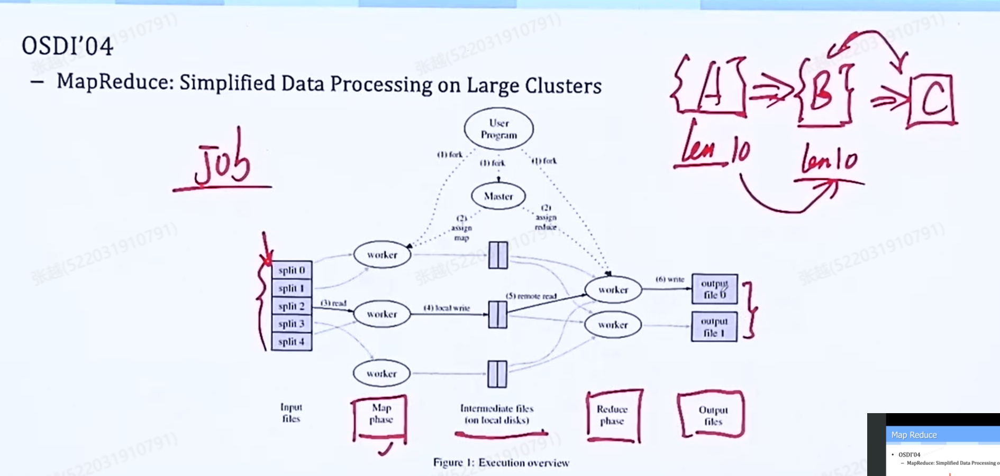

具体：Word Count例子：我每次Map完，对于Map的结果可以先在本地做一个Combine，然后把Combine的结果写到一个Reduce的worker可以读到的地方。然后我再调用一个Reduce，对combine结果进行规约
这才是真正的规约得到的结果。
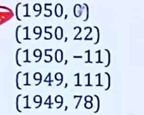

经过Combine操作后：
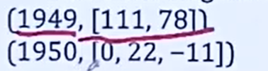

Shuffle是什么：我们规定每个Reducer处理对应段的字符串，因此在Map后我们要Shuffle，方便每个Reducer读取自己需要处理的集合（比如把A-N放一起，O-Z放一起），
Shuffle同时我们还要对结果进行sort，两个是一体的。
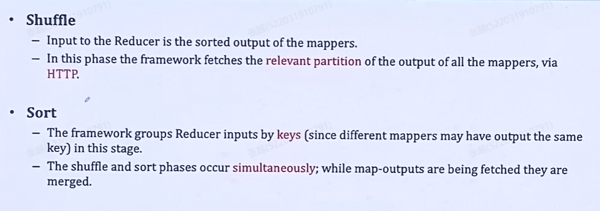
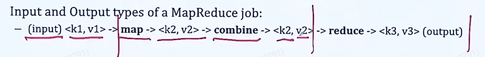
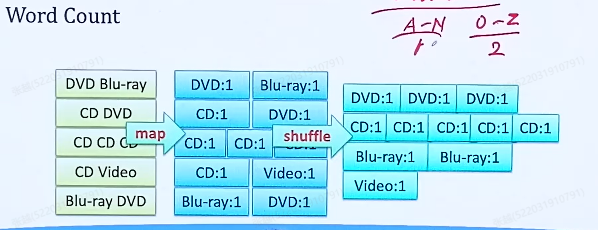
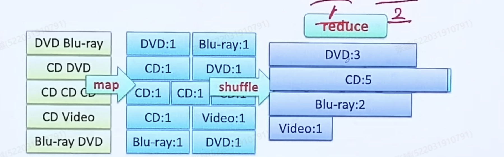
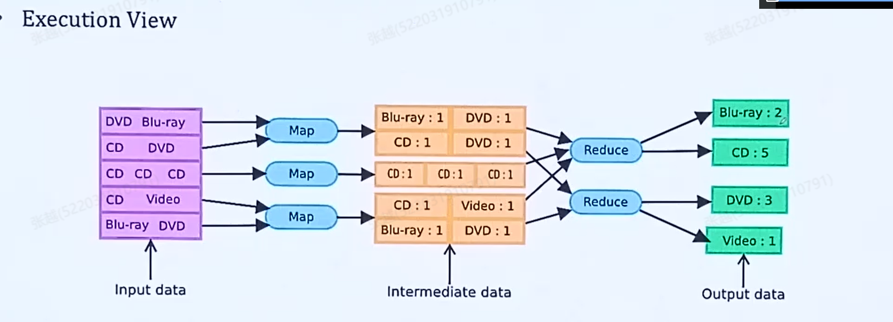

- ### 24.1.3 input数据格式

Map阶段的输入是raw NCDC data（原始NCDC数据），我们首先需要按行取出，在处理是时候我们在前面加入一个偏置量，知道每条数据的长度。数据map-reduce具体流程：

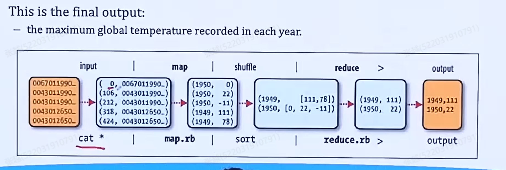

- ### 24.1.4 Combiner

    Combine 可以用也可以没有：

比如我们在求最大值时，我们可以在每个Mapper后做Combine操作，（其实就是对数据进行预处理）有些情况可以节省效率，有些情况不能优化。

    比如求平均值，我们对每个节点的map结果进行平均值计算的预处理就是没有任何意义的，所以具体情况具体分析。

- ### 24.1.5 input splits

Hadoop会把传给Map Reduce的出入数据切分成固定大小的pieces，称之为input splits，对于每个split调用一个map task。
split就是HDFS的block，默认值是64MB。

- ### 24.1.6 JobTracker V1.0

Map reduce中任务调度是怎么控制的呢。我们有一个jobTracker。我们先讨论JobTracker1.0的情况。

图中黄颜色的是我们的代码，我们提交一个作业给jobclient，发一个client包给hadoop，hadoop就把包给JobTracker，JobTracker就会新建一个job，然后就有可能
会读取一些HDFS上面的文件，创建好job后面就会找一些执行程序的机器，JobTracker会把代码扔给这些机器，执行的过程中会起一个单独的进程（TaskTracker），在这个过程
中TaskTracker一直给JobTracker发心跳包，如果心跳停止就寻找新的节点。

心跳：如10分钟内必须来三次，（一个时间段内来n次）。没有限制得很死。

    缺点：JobTracker需要管理所有可用资源、还要跟踪监控job运行状态，监控task tracker，任务过重。
    JobTracker成为系统的瓶颈。
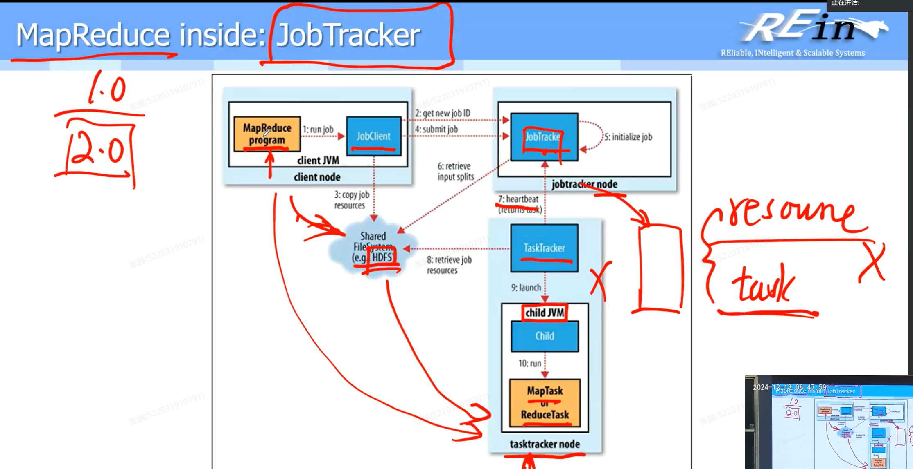

- ### 24.1.7 多少个Reducer

    0.95到1.75倍的节点数乘以每个节点能开的容器数。如果认为节点处理速度不强就用0.95，
    如果处理速度很强，就用1.75。

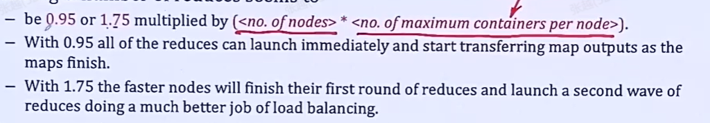

- ### 24.1.8 Partitioner
如果存在若干个reducer，我们可以使用Partitioner对数据进行分区，（可以设置）。

- ### 24.1.9 Hadoop的缺陷

我们的数据都在磁盘中，会有大量的I/O操作，是一个重度I/O的操作，极大影响效率，我们是否可以把数据放入内存中——这就引出了下一节课的Spark。

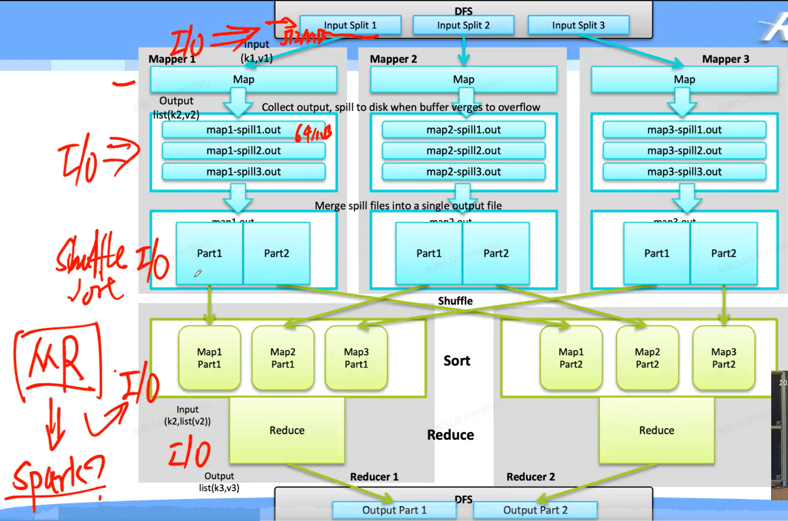

- 如果我一个节点的map操作中途出现问题，前面的处理都作废了，那么我们可以如何优化他？我们可以在每次map得到中间文件后直接Shuffle&Sort，传给Reducer节点，

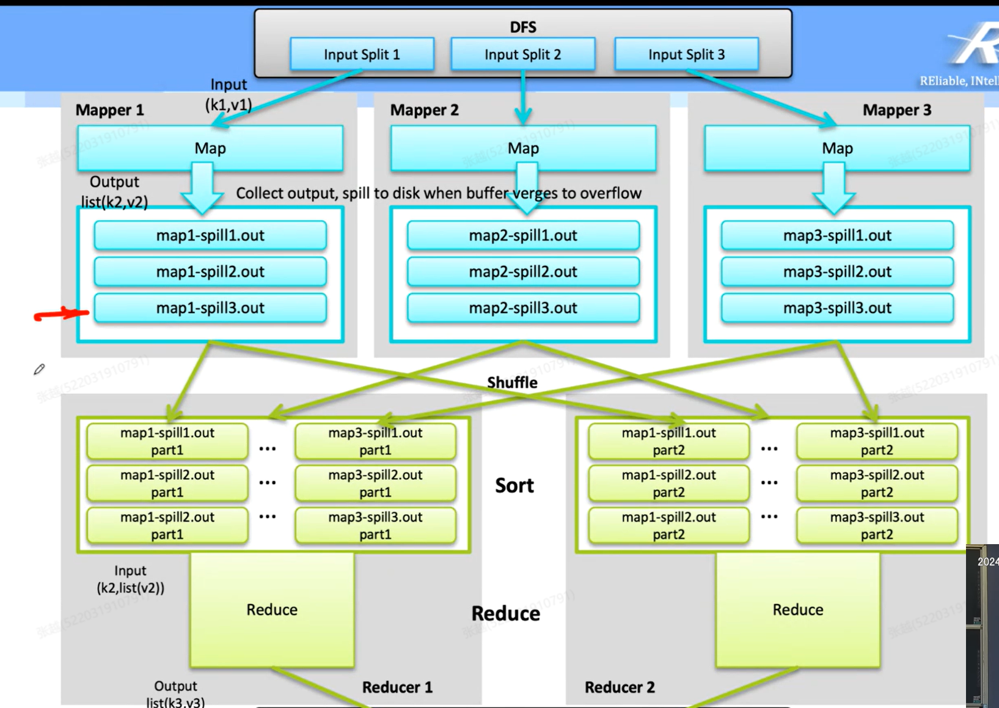

- ### 24.1.10 Map Reduce 2.0（YARN)

 -    原来version1的jobTracker里面实际上是把资源管理和作业的跟踪，是合在一起的，于是呢就会觉得瓶颈就会出现，Hadoop里面就会有一个所谓的下一代的
Map Reduce，也就是Yarn。这里面就把两个职责给分开了，资源管理由Resource Manager（Global全局的）管理，作业跟踪就用Application Master管理，而且不是有单独一个
Application Master来跟踪所有的节点，而是由每一个节点都有自己的Application Master。应用就是一堆的作业，彼此之间是一个DAG。

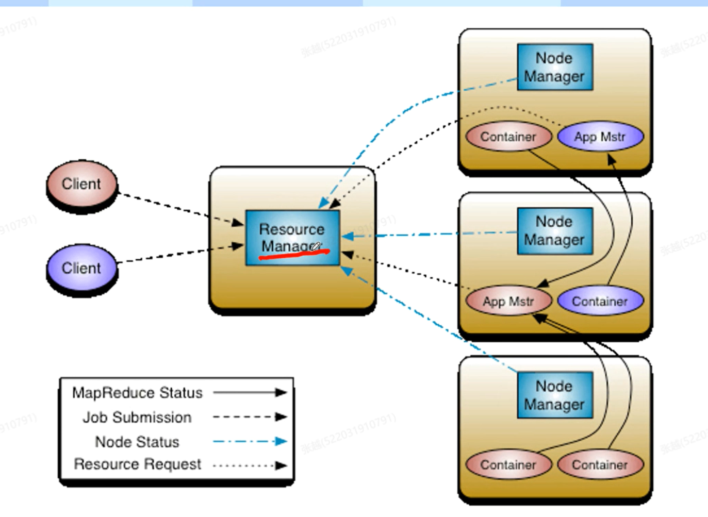

每一个Node内部都有一个Node Manager，Node Manager就会把node的所有信息发给Resource Manager，所以当客户端在发给Resource Manager
一个请求的时候，他就可以Node Manager提供的信息找最适合的节点去处理作业。

跟踪这个任务作业实时状态的逻辑和容器生成与销毁的逻辑都放在App Mstr里面去完成，
如果他发现一个容器心跳没了，就会像Resource Manager申请一个新的节点去retry。

通过这个分离职责，任务追踪和资源管理就解耦了。实现了更加均衡的实现方式。

## 24.2 RNN循环网络神经

- ### 24.2.1 循环神经网络含义

我们有一个网络层，我们的输入进去之后，产生了这一层的输出ht，当我输入下一个输入的时候，对于这个神经元来说，（比如这个输入是x0，输出也是h0），当输入x1的时候，
h0也会当成一个输入输回网络层。也就是说，每一次输出都包含了前面的输出提取出来的特征，就非常适合自然语言处理以及连续性数据的预测。（比如股票市场，我要预测一天的
股价，我们可以把前面20天股价数据输入进来，这样20天里面所有的特征全部用来预测最终的结果）我们要限定一个我们要回看多少行。

- 缺点：程序不能并行，必须要串行，速度比较慢。

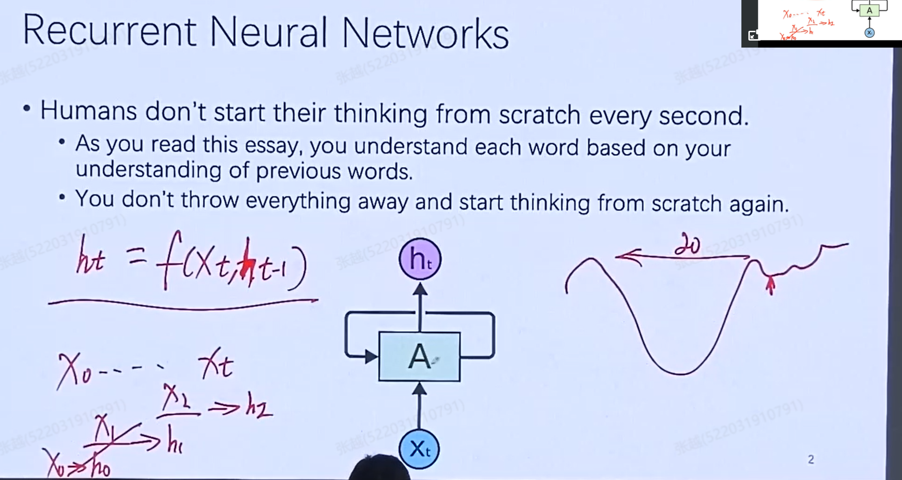

- ### 24.2.2 LSTM

 我们碰到不同长度的句子全部都用一个RNN模型吗，如果有的序列特别长的时候，效率显然不太好。所以我们可不可以分情况，可以把某些输出扔掉不进行保留，不继续传下去呢？

为了提高灵活性，我们需要引入LSTM模型。

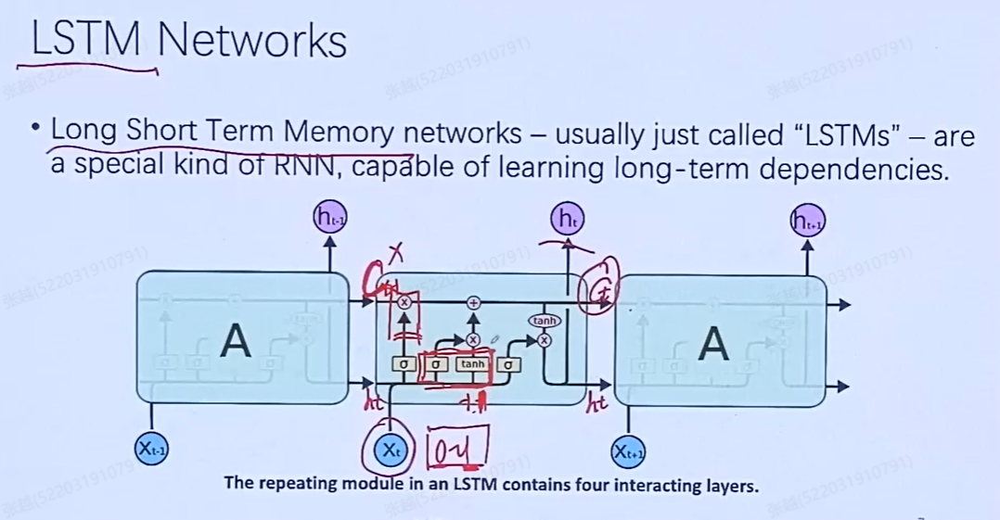

LSTM内部有许多的门，我们输入值进入以后，需要经过一个sigmod函数（激活函数），这样就会有一个0到1的范围。
如果我们的输入值经过激活后接近于0，跟前面输出的h(t-1)相乘，就相当于我把h(t-1)忘掉了，如果接近1，h(t-1)就会传下去。然后我们将h(t-1)和x(t)相加，
作为这一层的结果传下去。这样不会将所有前面的输出特征传下去。

具体如何结合h(t-1)和xt逻辑的算式如下，比较逆天，看不懂。

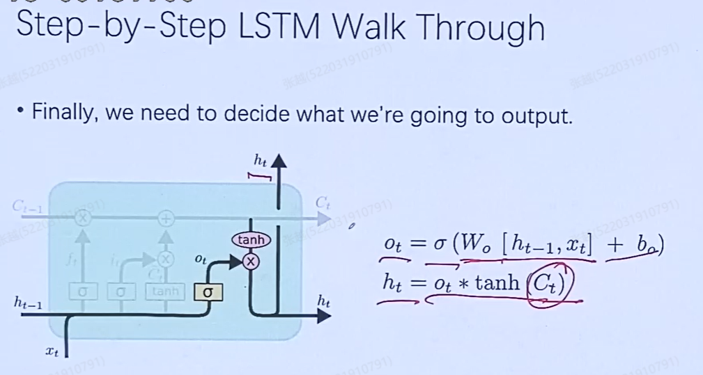

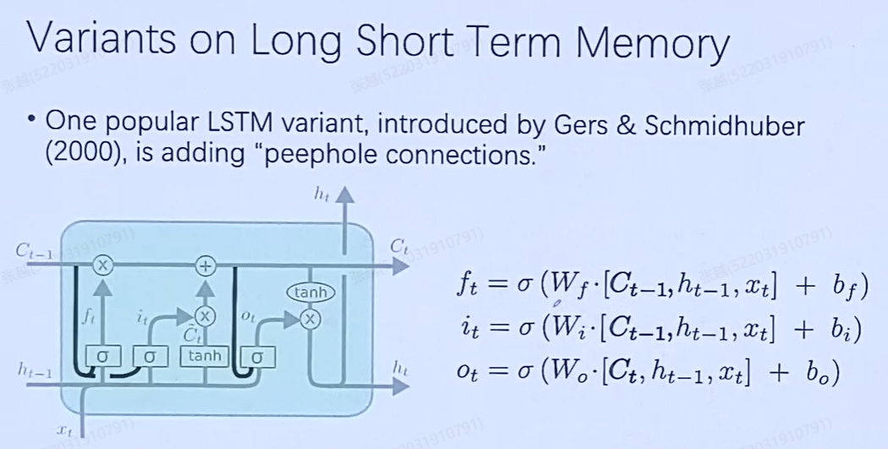

