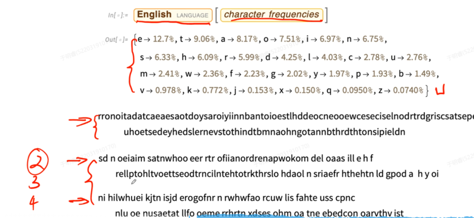
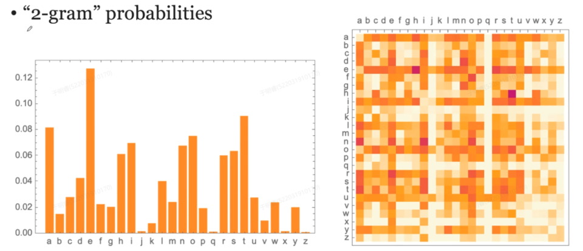

# ChatGPT

---

## ChatGPT是怎么做的

实际上是很简单的文本生成模型——**每一次只生成一个词**

在给定一个输入文本的场景之下，它会预测下一个单词出现概率最高的是哪一个

- **如果一直选概率最高的，只要输入一样不就会千篇一律的回答吗？**

  - **Chatgpt 中有一个`temperature` 的参数，也即温度**
  - 温度是 0 的时候， 就选概率最大的那个词
  - 温度不是 0 的时候，就有一定概率选择概率不是那么高的词
  - **这样由于每次都是选一个单词加入内容，然后基于现有内容再决策出下一个单词，当可以选择概率不是那么高的单词时，就可以基于不同的内容进行生成，具有很高的灵活性，体现了`explore` 和 `exploit`，即探索和利用之间的平衡** 
  - 只探索就会全随机，甚至最后不成话；只利用就会得到千篇一律的答案

- **下一个词是根据概率来选，那这个概率从哪里来？**

  - 概率是从语料中来的，语料则是从已有的资源中来

  - 比如统计 Wiki 中 cat 页面 和 dog 页面中出现的字母，当碰到 cat 或者 dog 时，会根据这个统计结果进行预测

  - 根据统计结果生成一个新的单词，就会根据字母出现的概率生成一个字符串，通过限制单词长度或者统计时额外加上空格，就可以生成一个比较像单词的结果（长度比较像英语单词了）

    

- **最后生成出来还是不像一个单词？如何优化？**

  - 采用 `2-gram` 双词源概率，即选字母的时候不是看单个字母的概率，而是看选了一个字母后它的后面出现的字母的概率

    

  - 左图是单个词源的概率，右图是双词源概率，每一单元格代表：**列字母后跟着行字母的概率**

  - 比如热图中 **q** 这一列几乎只有 **u** 这里有概率，说明 q 后面 几乎都是跟着 u 才能形成单词的

  - 在生成单词时，根据当前字母后面跟着的字母概率，以及温度（用来调控随机性）来选择下一个字母

  - 当然最后就演化成3词源、4词源，一直到 n词源，到了 n词源后就已经能生成很像样的单词了

  - **ChatGPT 是 把字母推广到了词，即一个词后面跟着的下一个词的概率是什么**

- **ChatGPT 把 字母 推广到 词 遇到的困难？**

  - 使用 `n-gram` n词源逻辑可能能够生成比较好的语句，但是问题在于字母只有26个，**而词是非常多的**
  - 因此采用降维的方法——Embedding
  - 不用很高的维度来描述单词，降低维度后，一些特征比较相近的就会落在一起

> **总结基本逻辑：**
>
> 1. **一定要先通过 Embedding 降维，不仅要 Embedding 单词 还要 Embedding 它在句子中的位置，两者加和才是这个单词的特征**
> 2. **经过 n 多个 注意力机制（a sequence of attention blocks），也即 transformer 的 main events，注意力就是两个单词之间的关系是什么样的，得到最终的嵌入特征**
> 3. **最终这些数值将作为全连接以及分类输出的依据**