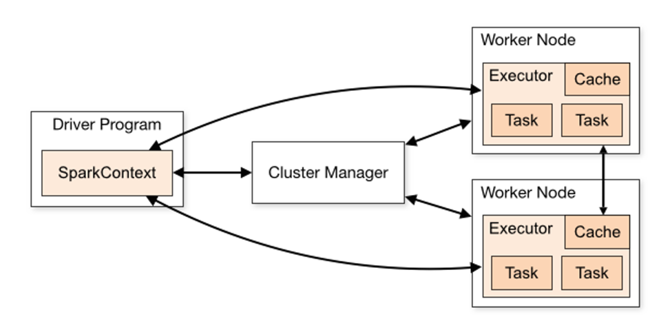
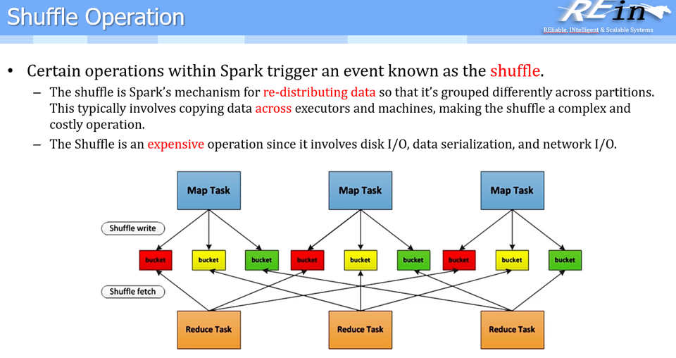
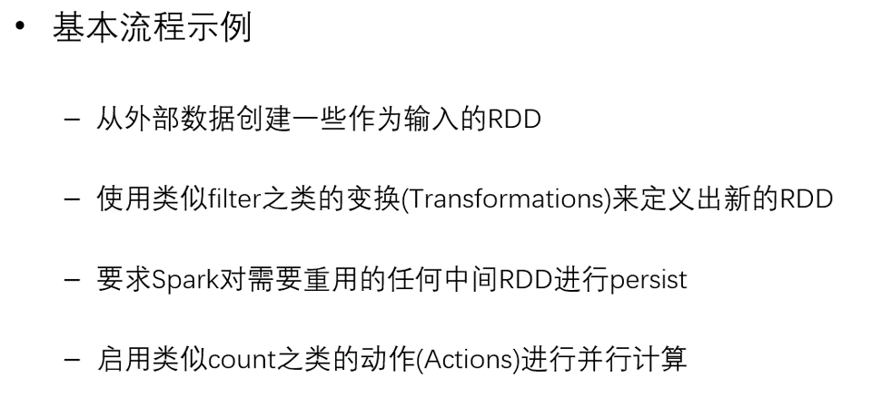
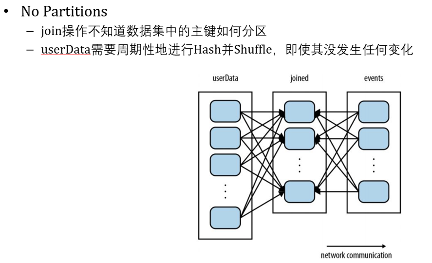
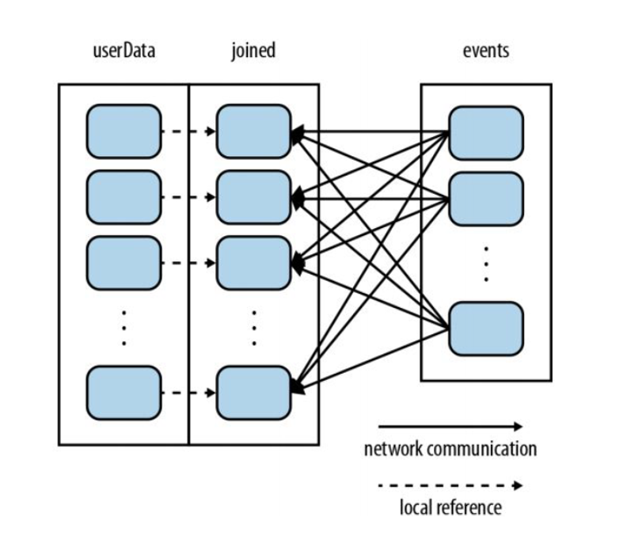
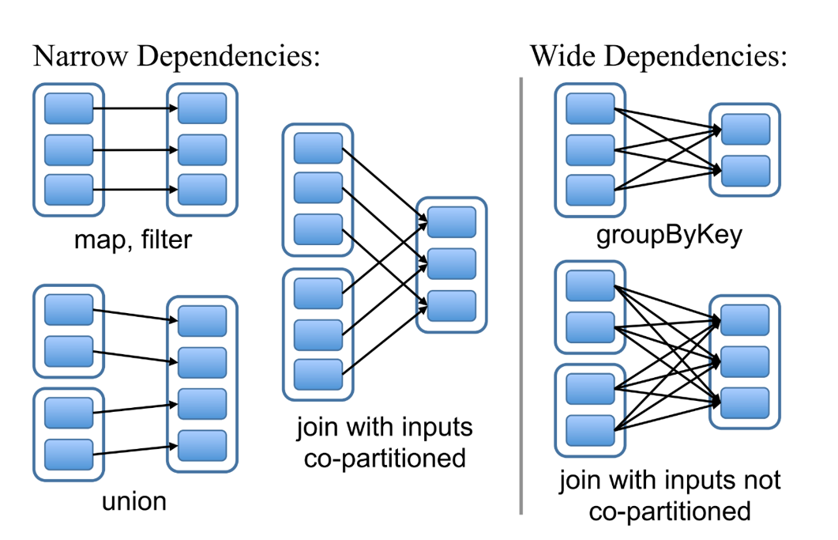
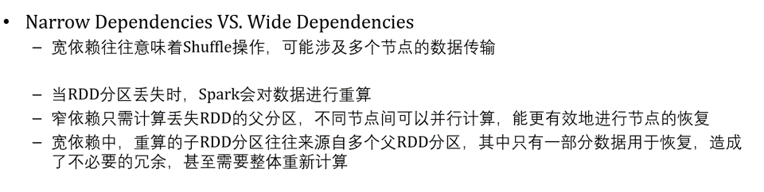
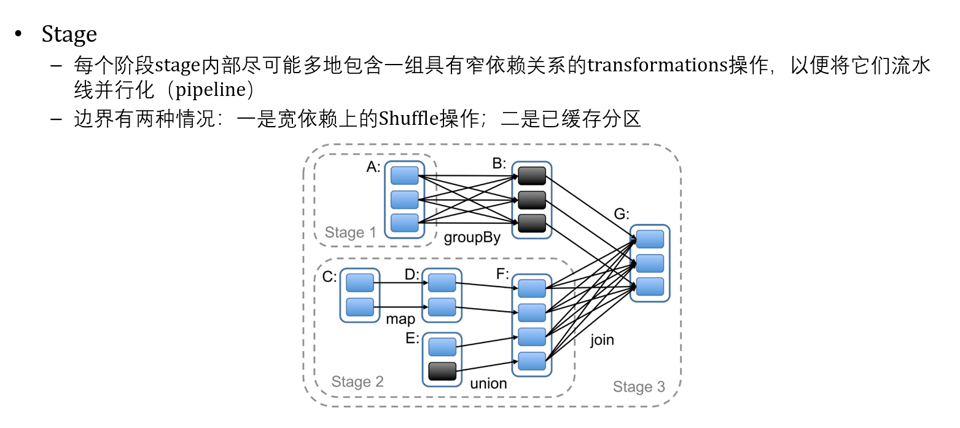

# 25 - Spark

### 对大规模数据做分析，在内存中进行，比较快速

### 支持的语言很多：JAVA | PYTHON | SCALA

### Spark本身用Scala写的， 用Java代码量是其6倍

***

## Spark 的主要构件

 1.  **批处理 / 流式数据：Batch / Streaming data**

    - Batch data 和之前看到的 `Hadoop` 里面做 `MapReduce`是一样的

    - Streaming data 始终是源源不断的来，没有开始没有结束，因此与 Batch 的处理不一样

      

 2. **支持 SQL 的操作**

    - 底层的数据实际上不是结构化数据的表，不是关系型数据库的表

    - 实际数据是以 `RDD` 或者 `DataFrame` 的形式

      > 把文件读进来实际上就是读成 **DataFrame**

    - 在 `DataFrame` 之上可以用 **SQL** 的方式去操作它

      > Spark 能够把 **SQL** 语句转化成对 **DataFrame** 的操作
      >
      > 因此不需要在 **DataFrame** 上记录很多专有的接口，只需要用 **SQL** 就能直接操作它

 3.  **支持机器学习和数据分析**

    - 目前用 `Pytorch` 或者 `Tensorflow` ，因此只是简单介绍一下

---

## Spark 优点

1. 性能表现很好

   - 使用内存计算，workloads 比 `Hadoop` 快了 100 多倍

     > Hadoop 在 MapReduce 等操作时重度使用磁盘 IO

   - 数据结构更简单

     > 使用内存，内存是一维的、线性的，因此数据结构可以比Hadoop更简单，比如一维一直去增长

   - **因为Spark是完全内存计算，因此对内存的需求比较大，如果内存开的太小，就会进行虚拟内存和磁盘间大量的换页操作，从而导致速度的降低**

2. Spark 拥有多用途的核心组件

   1. **Spark Core**
      - 支持让Spark跑起来，包括 `RDD` 这样的数据集，以及支持并行
   2. **Spark SQL**
   3. **Spark Streaming**
   4. **MLlib**（机器学习的库）
   5. **GraphX**
      - 专门对图数据进行加速处理，包括图计算、图上的机器学习

---

## Spark 实例：Log Mining

### 场景：有一个Driver（Master）和三个Worker，以及要读入一个规模很大的Log，需要过滤出其中报错的消息 (以下为SCALA代码)

1. `lines = spark.textFile("hdfs://...")`

​       **使用Spark的上下文环境，将 HDFS 中的某个文本文件读取进来**

- 这里要注意的是 lines 读进来的是 `RDD` （分布式数据集）在内存里， 是不可以改的

- 也就是说数据集被 Spark 加载进来后，本身的值就不能被修改了，意味着可以复用（例如不用担心多线程问题，在集群环境下就可以免除竞争、加锁的情况）

  

2. `errors = lines.filter(_.startsWith("ERROR"))`

   **类似Map的转换（transformation）操作，从一个 `RDD` 变成另一个 `RDD`，即过滤 lines 里面以 ERROR 开头的信息**

- 这里的 errors 转换并不会改变 lines 里的内容

3. `messages = errors.map(_.split('\t')(2))`

   **将 ERROR 信息中的部件分隔开，并取出其中的第二个部件，也即错误日志的messages，这是第三个 `RDD`**

   

4. `cachedMsgs = messages.cache()`

   **将messages给cache住**

- **为什么要将其cache住？**
  - 内存是有限的，把所有`RDD`放在内存里，那内存满了怎么办？此时有两种方法：
    - 一种是使用 `LRU` 把一些不使用的RDD直接抹除（Remove）
    - 另一种是使用 `SWAP` 把最远被访问的写到disk，把新进来的写到内存
  - 此时的 `cache` 就相当于在内存中做了一次  `PERSIST` ，此时上述两种操作就不会作用到这个 `RDD` 
  - 但是这也只是一个愿望，如果内存最后实在不够，还是会进行 `SWAP` 等操作
- **Spark是分 stage 执行的**
  - 在前三行代码执行过程中，Spark只是维护一张计算图，并没有进行任何的计算操作
  - 即使加载进来的文件不存在，如果没有运行第四行的cache，也不会报错
  - 只有进行到cache操作（跨stage），才会反推回去把前三行执行，此时才会报错加载文件不存在等错误
  - cache住的RDD是要持久化在内存中，而前三个RDD是为了产生cache的RDD产生的中间结果，此时就可以进行LRU或者SWAP，这是可以接受的

5. `cachedMsgs.filter(_.contains("foo")).count` 

   **把包含`foo`的拿出来，`count` 相当于 Reduce 操作，同样前半部分是一个 transformation，仍然不会立刻执行，而到后半部分的count （Action） 才会执行**

- 具体的计算（例如这里的 count）是要并行执行的，日志分部分加载在三个worker上，三个worker同时进行count，最后汇总
- 当然由于这里的RDD是被Cache住的，因此可以复用来计数其他内容，比如 bar ...

> **总流程 ：**
>
> **-> Log 被分成三个 Block 加载到三个 Worker上  （注意：从lines加载到后面的所有RDD是在三个Worker上都有的，逻辑上是一个，但实际是三个）**
>
> **-> Driver 派发任务** 
>
> **-> Worker 并行处理，将结果返回给 Driver**
>
> **-> Driver 进行汇总**
>
> 
>
> 具体怎么分成三块，以及并行计算后如何汇总，这就是Spark框架帮我们做好的了
>
> 总结来说：Transformation、Action、分stage执行、遇到stage边界后反向回推执行、RDD不可修改、RDD是分布式对象
>
> 除了第一步涉及磁盘读，其他所有都是内存操作（理论上）

---

## Spark 运行

### 至少要有两个节点：一个 Cluster Manager，以及至少一个的 Worker Node

应用程序通过一个spark context 提交任务给 Manager

Manager 会把任务派发给 Worker node 执行，执行过程中 Manager 要监控 Worker Node， 任务执行过程中频繁使用Worker Node所在机器上的 cache

最终结果会返回给 应用程序

由于集群的运行被 Cluster Manager 屏蔽掉了，因此在外部看来就是在多线程上运行的应用程序

- Worker Node 需要可以被 Manager 网络寻址 （network addressable）
- Manager 上要跑某一种集成管理工具，例如 YARN / Mesos / Kubernetes / Zookeeper （Manager 内置）
- Manager 运行方式分为 Standalone / Apache Mesos / Hadoop YARN /  Kubernetes
- Manager 同时也负责 监控 和 任务调度

**Spark 提交执行脚本：spark-submit script**

- (spark-submit 所在路径)/spark-submit --class "运行的程序主类名" --master (master启动的URL) target/(打好的jar包)

> **流程总结：**
>
> 1. **写好一个应用，打包成 jar 包，丢给 script 脚本 （驱动程序）**
>
>    > 注意直接运行应用会报错 `找不到主类`，必须打 jar 包丢给 script 脚本
>    >
>    > SCALA 也是jar包， PYTHON 是 py 脚本
>
> 2. **通过 submit script 交给 Cluster Manager**
>
> 3. **Cluster Manager 找到 可用的 Worker Node 进行 任务分发 、 调度、 监控**
>
> 4. **Worker Node 中的 Executor 执行 任务 （ Job），通过一堆的 Task 执行得到，并且执行过程中要写一个DAG，分stage执行**

**Spark 还支持 SCALA 版本 和 PYTHON 版本的 命令行 shell， 分别为 spark-shell 和 pyspark，这里的具体操作可能不重要，因此我在笔记最后和三种版本的Spark 代码一起贴个图**

---

## Spark RDDs 弹性分布式数据集

### Resilient Distrubuted Dataset

- 弹性：可以很大也可以很小
- 分布式：逻辑上是一个对象，但可能分布在多个节点上，最大的特点是在多个节点存一个数据集可以并行处理
- 如何获得一个RDD：
  - 调用 （SparkContext的`parallelize`方法）`sc.parallelize`就可以把一个数组等变成一个RDD
  - 调用 （SparkContext的`textFile`方法）`sc.textFile`就可以加载一个文件成为一个RDD

1. **RDD 一般都是分区的 （Partition），可以 load 到一个 集群里面，一旦 load 到一个 集群，将来运行一个任务时会对每个partition都有一个task**

   

2. **RDD有 Transformation 和 Action 两种操作**

   - Transformation : 将一个 dataset 变成 另一个 dataset （典型：Map）

     - **所有 Transformation 都是 Lazy 的，不会立刻执行操作，而是等一个 stage 结束 或者 遇到一个 cache，才会反推执行所有内容**

     - 包括 **map 操作**：对 RDD 中 所有的内容 做一个 映射，比如平方...

       ​	 **flatmap 操作**：类似 机器学习中的 flatten 层，在做摊平操作（比如对["hello world", "hi"] 做 flatmap 会得到一个一维数组，包括 hello、world、hi 三个词

       ​	 **filter 操作**：做筛选，比如选出所有的”error“

       ​	 **union 操作**：做合并，比如将 errorsRDD.union(warningsRDD) 得到一个 badlinesRDD

     - 以上操作**均不会改变RDD，只会创建新的**

   - Action：对 dataset 进行计算 并 返回一个值 给 driver program（典型：Reduce）

     - 包括 **reduce 操作**：对 RDD 中的内容 做给定操作，比如求和
       	 **count 操作**：做行数的计算

       ​         **collect 操作**：统计 dataset 中所以元素并返回一个数组

   - **为什么要把操作做上述两类区分？**

     - 计算是分 stage 的，在 stage 内部是一个 lazy 的计算方式，stage 告诉我们什么时候开始计算

3. **Spark 中触发事件的操作 ：Shuffle （类似 Hadoop）**

---

## Spark 分 Stage 计算

### 用一个例子来看：

> **假设程序在内存中持有一个非常大的用户信息表（UserID，UserInfo），其中UserInfo包含用户订阅的主题列表**
>
> **有一个很小的表，是过去五分钟内用户在网页上点击链接的事件（UserID，LinkInfo）**
>
> 这两张表看起来是通过UserID关联的表，但实际上是两个RDD，不是关系型的表
>
> **程序周期性地对两张表做`合并`和`查询`**

1. **No Partition**

   

   - 如果不做分区，用户数据只是按照加入进来的顺序进行切分，那么数据是没有什么规律的，因此若要查询用户A的点击事件，需要在events集合中全都查找一遍才能生成join操作中的一块数据
   - 如果要生成两张表的join结果，就需要用userData中每个数据找一遍events中的所有数据，**效率很低**

2. **Partition**

   **在加载（UserID，UserInfo）时，使用哈希进行分区**

   

   - 和之前的差别在于，不做分区时，同一个用户信息可能分布在不同批次加载进来的数据中，因此join需要遍历userData
   - 而采用了 Partition 后同一个用户就只用到一个块中找，**join子分区只依赖于一个userData父分区**，得到了一个**性能优化**

## Dependency 依赖的类型

- **窄依赖（Narrow Dependency）**
  - **父分区的每个RDD只被子分区的一个RDD使用**（注意不要反）
  - 上面的 join 和 userData
  - **而且如果在分布式环境下，同一个窄依赖可以放在同一台机器，从而提升性能**
- **宽依赖（Wide Dependency）**
  - **父RDD的每个分区都可能被多个子RDD分区所使用**（一个父指向多个子）
  - 上面的 join 和 events
  - 性能差

​										**上图中左侧是 窄依赖 ， 右侧是 宽依赖**

## 窄依赖 和 宽依赖 对比

​	要注意的是**宽依赖是不可避免的，但是我们应该尽可能使用窄依赖**

## Stage

**将整个计算画出一个DAG图，将其中窄依赖尽可能放在一个stage**

**以C开始为例：C->D/E->F均没有跨stage，因此当执行到G时，stage2结束，才会回推执行CDEF**

- **好处**
  - 只要执行一个操作，如果是 Tran：
    1. 一定要创建一个新RDD，如果stage很长，那**在很早的时候就计算出RDD**就会**占用、浪费内存**，而当跨stage后，不得不用前面的RDD去计算了，再让前面的RDD去计算
    2. 并且 stage 内部是窄依赖，一个分区只依赖一个分区，并且几个分区可能在同一台机器的内存中，速度很快，因此**在结束时才计算**就可以**节省内存占用**

- 上图中**黑色部分是进行cache**，**为什么E中有个分区进行了 cache 但是没有单独分一个 stage**？
  - 因为之前没有用到RDD，也就是说这个cache实际上是被直接拿来复用的，不是依赖于RDD生成的cache操作

## RDD Cache（Persist）

**RDD Cache 分为以下几种内存存储逻辑**

- **MEMORY_ONLY**：始终放在 内存，如果放不下会把其他RDD移除或者放进DISK，等到用到再重新计算或者拿回来
- **MEMORY_AND_DISK**：可以放在内存里，不适合放内存的时候可以把一部分分区拿到DISK
- **MEMORY_ONLY_SER** (Java and Scala)：只放在内存，并且RDD对象是一个序列化之后的对象，将来可以用于在不同服务器之间传输
- **MEMORY_AND_DISK_SER** (Java and Scala)：跟上面的对应
- **DISK_ONLY**：只放在DISK
- **MEMORY_ONLY_2, MEMORY_AND_DISK_2**, etc. 和上面一样，只是要把每个分区放在两个node做备份
- **OFF_HEAP** (experimental)

**当数据要被移除时通常用 LRU， 也可以用 unpersist 做一个反向操作来处理掉**

---

## Spark SQL

**底层放在一个RDD 或者 DataFrame 中， 可以用 SQL 语句来操作**

- RDD 是一个完整的对象，比如一个person就有name、info等等
- DataFrame 是一个结构化更好的数据对象，有列式结构，结构化更好（也是创建好就不能修改了）

**如果对 SQL 更熟悉的用户，使用Spark也很方便**

---

## Structured Streaming 流式数据处理

**数据源源不断的来，如果存入一个表中，这个表就是在无限增长，如何进行word count类似的操作呢**

- 微观上仍然是 Batch 批处理
  - 增量式处理，某个时间点对距离上一次处理之间新增的输入 / 对原来输入的更改 进行处理和返回，处理结果会一直保留
  - 总体来看是流式处理，微观上看是批处理（增量式）

**数据可以通过 kafka 等工具传入**

- 数据传进来后会被切成一个个小批量的批数据来传入Spark Engine，时间间隔很短，每个批数据的处理是增量式的而不是孤立的，看起来就是一直在流式处理

**在数据湖中提到过的流批一体在Spark也可以做**

---

## Spark 中的 MLlib 和 GraphX

​	重点在于做并行，虽然现在大多使用pytorch等张量计算，但是对于非张量处理（随机森林、决策树、逻辑回归）可以用MLlib

​	GraphX就是将节点和边分别存在两个不同的RDD中，这样就可以将图做的很大

