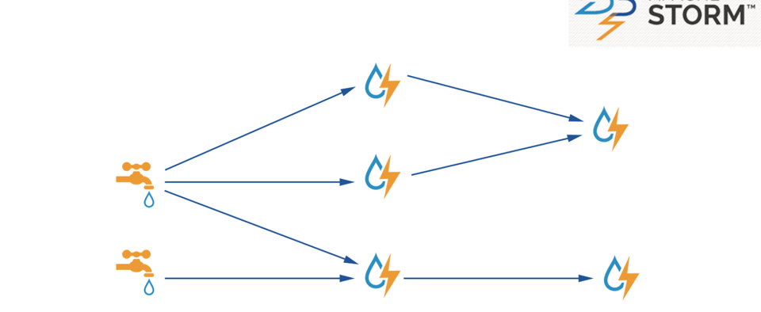
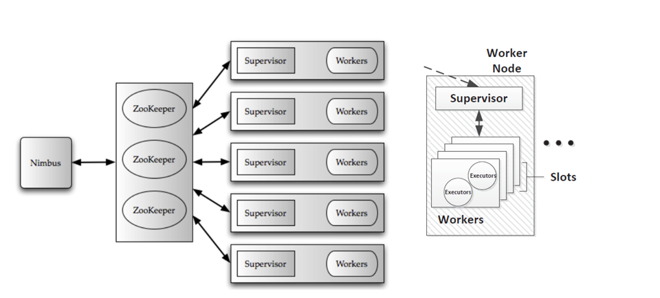
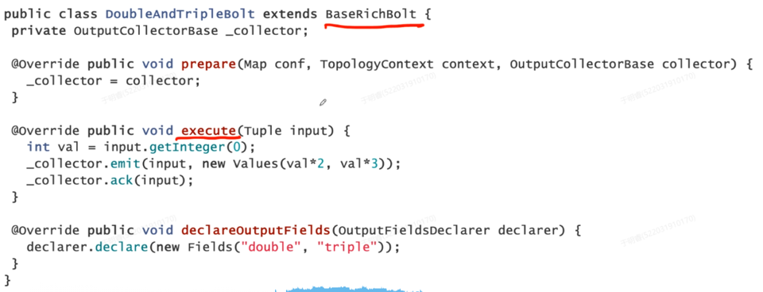
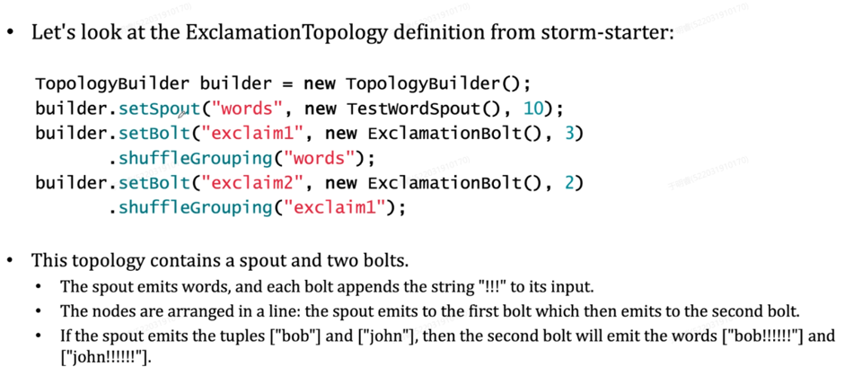
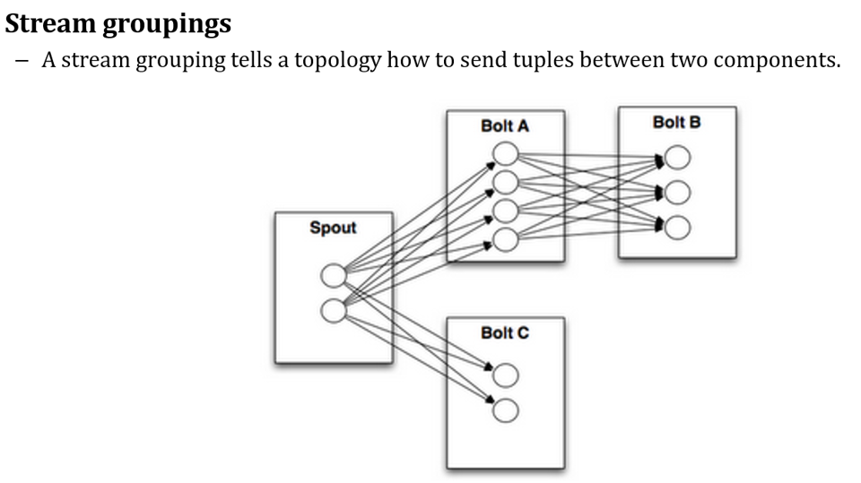

# 26 - Storm

## 专门基于流数据处理做的框架

---

## Storm 框架

- 数据源（Spout）就像水龙头，不断输入数据，可以来自队列或者数据库
- 中间有一些处理节点（Bolt），对流入数据进行处理，解析图片、文本、统计字数等
- 处理完后交给下一个处理节点进行处理，处理在微观上仍然是批处理（类似spark）

输入源+处理结构，是一个**计算的DAG图**，也叫一个**计算拓扑**

---

## Storm 运行逻辑

**和Spark、Hadoop非常类似**

- 默认使用**Zookeeper**进行集群管理
- 由 **Nimbus** 作为管理节点来管理一堆 **worker**
- 每个**Worker**上有一个 **SuperVisor**，作为监听器监听 Worker 上的内容和状态并汇总到 **Nimbus**
- 一个 **Worker** 中分了许多 **Slots**，一个 Slot 可以理解为单独执行一个任务的一个进程，受 **SuperVisor** 监控
- **Nimbus** 根据 **SuperVisor** 的汇总进行 **Worker** 的统一调度

---

## Storm 集群中的组件

**与Hadoop 集群很像**

- 与 Hadoop 不同的是，Storm不是运行 `MapReduce` 这样输入给好的作业job，而是运行 `topologies`
- `topologies` 和 `job` 在逻辑上很相似，但是区别在于 job 最终会 finish，而 topologies 是永远没有停止的

**同样需要一个 master 与至少一个 Worker Node**

- master 节点上运行 **Nimbus** 进程，与 Hadoop 的 **JobTracker** 类似，负责在集群中分发代码、将任务分配给机器以及监控故障
- 每个 worker node 上运行一个 **SuperVisor** 进程，负责监听机器的工作状态，以及接受 Nimbus 命令来启动或者停止机器运行
- 每个 worker node 上运行 **topologies** 的一个**子集**，topologies 通过这些 worker 来执行和传播
- 所有 Nimbus 和 Supervisor 之间的联系通过 **Zookeeper 集群**实现（机器挂了等等...)

---

## Storm 中的 Topologies

**一张 DAG 计算图**

其中包含处理节点 bolt 与 源节点 spout，这些节点共同构成了 stream 流

执行方式类似 spark，也是使用脚本来跑

`storm jar all-my-code.jar org.apache.storm.MyTopology arg1 arg2 `

- 这将运行带有参数 arg1 和 arg2 的类 org.apache.storm.MyTopology
- 该类的 main 函数定义拓扑并将其提交给 Nimbus。
- storm jar 部分负责连接到 Nimbus 并上传 jar

### Data Model

Storm 使用 `tuples` 作为数据模型，即 a named list of values

**下面是一个Bolt 的实例**

**以及多个 Bolt 如何 结成一个 Topologies**

其中构建了一个 包含 1个 spout 和 2个 bolt 的 topologies，其中的 10、3、2是传给处理函数的参数

**最终运行效果类似 Spark 的宽依赖执行：**

---

## Zookeeper

**前面一直讲的 Zookeeper 到底是啥**

- 监控集群中的所有机器
- 会在所有机器中选一个 leader，通过心跳来管理其他节点