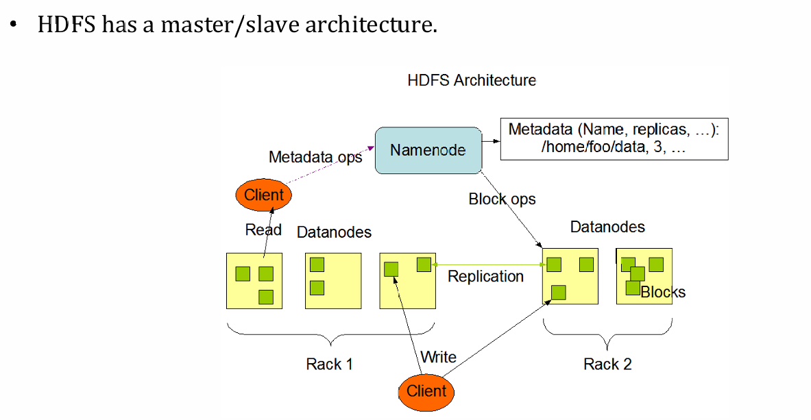
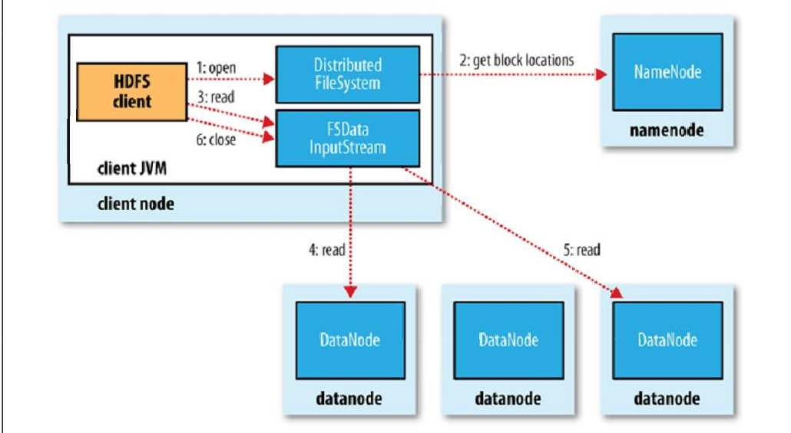
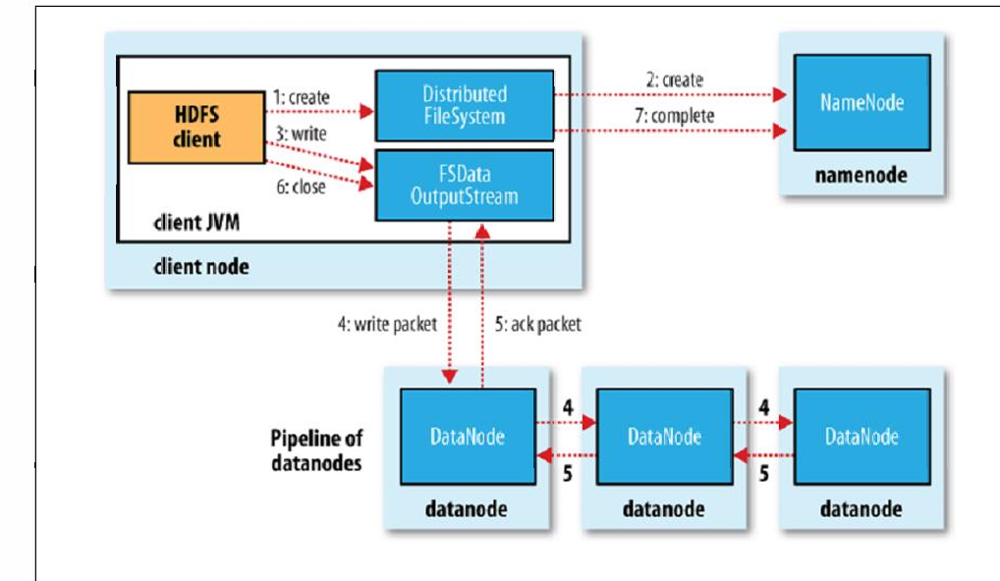
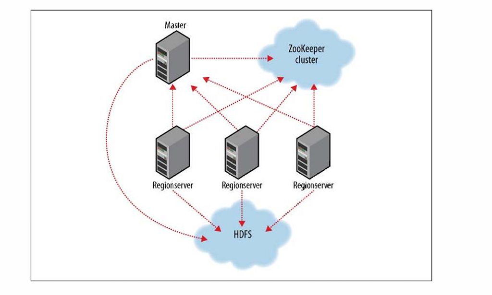
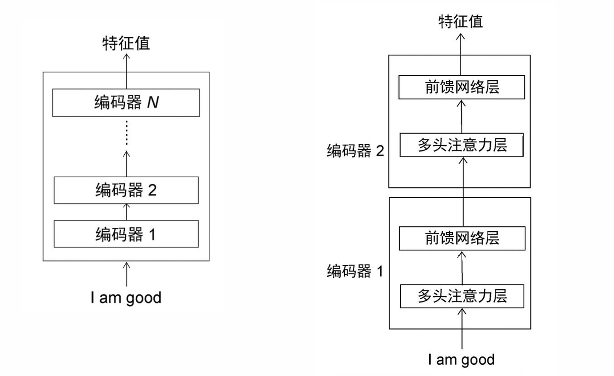

# hdfs+hbase+transform part
---

- ## hdfs
来源：谷歌写的一个分布式文件系统的实现。
**特征：**
- **专门用来存大文件的,至少大到需要分成不少block，小文件别用hdfs**
- 流式数据访问,在写入时**最好只写入一次(并行写存在问题,最好有个写入器写)**(读可以多次),**数据不适合做修改**!
- 廉价硬件:经常是使用一堆廉价硬件来实现的.

**不合适:**
- 数据不大的时候不适合.
- 对数据读写有低延迟要求时也不适合.(hdfs的写入效率和读入效率都不算高)
- 如果想多人写入/修改数据的时候不适合.

**适合:**
- 如视频这类是可以的,存电影这类是可以的,不修改,也很大.
  
---

hdfs的架构:

上层节点进行元数据处理(比如怎么切block,切出来的block放在哪里之类的),底下的节点是实际存储数据的节点.
用户过来会先到上面去操作元数据,namenode在metadata里找到相关信息后返回给client的jar包,拿到信息后拿着客户端去底下读数据,namenode只操作元数据,实际数据和namenode无关.

**副本情况:**
副本主要两种,同一个基架下的副本和不同基架下的副本.----这导致读操作的时候可以负载均衡,而写操作需要对全部副本写入.(流水作业,因此浪费时间).
**启动与心跳**
启动集群先起namenode再启datanode.通过datanode发心跳给namenode来确认datanode.(确认活着进架构,确认副本规则不被破坏),没收到心跳就认为死了,把数据发给其他节点.这里的心跳中还含有bolck-report:报告自身的data情况,帮助namenode把控block数据的情况.
整体还是**master-slave架构**,namenode是master,datanode是slave.
一般来说namenode会专门拿台机器跑,和datanode分开.datanode一个机器上可以跑一个或者多个.(但实际上跑多个没啥意义,跑一个一般,但也不排斥就是了)

**一些小点**
namenode里设置的副本数量不是一个全局的超参数,实际上你可以给每个文件单独设置.设置越多,可靠性越高,浪费空间多,写入效率降低.存储block的时候是可以分开存的,同时block的参数都可以设置(namenode上),但无论如何,写入都是一次性且单个写入头写入,eg:
- 我要写数据了:client->1->2->3,然后每个都写完了再报告上一级自己写完了:3->2->1->client.

**基架感知**
它一定会把副本帮你相对分配到各个基架上,而不是塞到一个基架里.(鸡蛋不放进同一个篮子)当然这样做会提高写的代价.(网络距离变大了),哪怕replica超过4进入随机选基架模式,也不会roll到同一个基架上,它一定是分散开的(类似mongodb的mongos).

**safemode**
namenode刚启动的时候(注意到之前提过它是第一个启动的),处于一种安全运行模态,等着底下的黑奴datanode发心跳和block-report,安全模式不对外提供访问,等到block的replica达到要求才退出安全模式.**简而言之就是刚开始的时候先封闭整个系统的对外访问,等到实际运行起来才开放**.

**editlog**
可以简单类比为mysql里的log一样,记录你对文件系统的操作,先写日志,再实际操作.由于hdfs是在本地文件系统的上层,所以启动hdfs本身也需要被记录,这份记录就记录在本地文件系统里.至于其他的存fsimage文件里,这个也是在本地文件系统,这俩核心部件都不在hdfs里的.启动后会**先把上次可能的还没做完就退出的操作(但是记录在日志上的)先做了,然后确认hdfs状态和log状态一致后就可以删日志了(避免日志越来越长)** 上述的清理日志功能也可能由checkpoint来做.而上述的两个核心log也有副本,防止这两个核心部件出问题,且副本是**时时同步的**.

namenode和datanode中间的协议走的tcp/ip协议.任何⽂件都会有⼀个crc校验码, 避免传输损坏/恶意篡改.写pipeline, ⼀定要全部写完,读负载均衡.

机器上数量不平衡的时候会做一次再平衡操作.

为了保证数据的完整性,一般会生成checksum来校验.(单独文件存)
读写示意图:(实际的过程上述已经描述过了)

- ## hbase
来源:hadop中的bigtable的开源实现.
存结构化数据和半结构化数据,没关系型数据库的结构要求这么高.本身的数据存储也可以分布式存储.
含有布隆过滤器帮助加速.
对第三方网关有支持.
支持auto sharding
支持谓词下推
支持map reduce

**面向列存**
这导致hbase支持垂直分区,还有列组的概念.存的数据是有版本的.(建立在hdfs上)
行列交叉点称之为cell,cell是带版本的.可以通过时间戳或者版本向前追溯数据.在hbase里,key是严格有序的.

version(timestamp)还有⼀些时序保证,例如字段的时间戳倒序, 还有例如在t4时刻发出的数据请求, 在t6时刻被处理, 保证不会读到t5的数据(类似MVCC, 找第⼀个满⾜时序的version)的因果保证

列族支持动态加入到表里(同理,列也行),每个列都属于某个列族,所以这会导致可能不同行的列数不同,有些行不具备某些列.(**列族数目不建议超过三个!!!!**)因此是支持按列分区的(竖切),当然也支持横切,得到的产物被称为region,而region-server就和hdfs里的datanode基本一样了,而root就类似namenode,会记录元数据.

有时为了节省空间,当一段时间没变时,这个时间戳就不记了,比如t1,2,3,到t7才变,那可能中间的t5t6就没记下来.
**经典例子之webtable**
每⼀⾏是⼀个⽹⻚, 然后例如url这种数据和版本号匹配很好.

大致结构如下:

- ## transformer
论文结构如下,主要结构是编码器和解码器.
编码器接受输入并提取特征,解码器根据特征分析输出.

三个关键矩阵:查询矩阵,键矩阵,值矩阵:用于计算输入的特征之间的相关性.经过矩阵乘法,缩放,softmax,最后得到了注意力矩阵(组成编码器).一般有多个注意力矩阵.