# Hive
Hadoop框架下的数据仓库，很多大厂还是使用hive进行存储

## 数据仓库与数据库的区别
### 1. 最大的区别是他是schema on read：Load一个data的时候不做任何校验，当发生查询的时候才会发生ETL操作
hive底层是HDFS，大量数据使用原始文件存储在HDFS，hive在上层读取它的内容，转化成同一个中间格式（parquet等），在上层使用类似sql的语句访问。

ETL操作：Extract, Transform, Load

**问题**：数据格式不是很好可能会有缺失，比如csv会有格子NULL，他转化为parquet会不会质量不行，什么时候做检查？

**回答**：LOAD DATA语句只会将文件加载进HDFS，只有当执行sql语句访问这个文件时才转化为parquet。转化需要的信息（如这个表格有哪些列）存储在metadata store里。

**schema on read优点**：数据会源源不断地进来但未必会使用，不要在加载的时候浪费大量的时间。数据湖也是类似。

mysql是schema on write，数据写入时进行校验，比如Not NULL列检查是否为NULL

---
## Running Hive
derby是内存数据库，存metadata
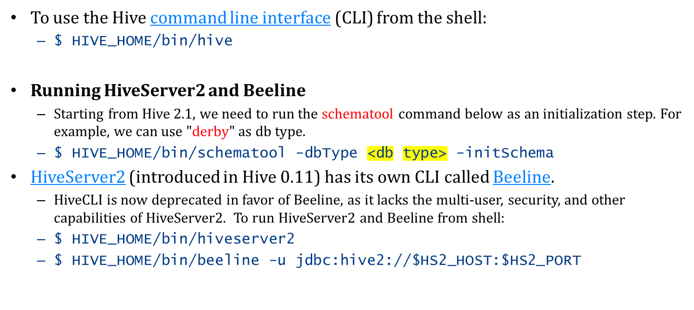
省略了配置运行的教学内容

## Hive partition and bucket
**partition**分区，Hive存储在分布式文件系统里，所以需要分区。和sql一样按照range或key分区

**bucket**是在分区的基础上再分区，1. 提高查询速度，2. 方便进行采样：
比如机器学习分割测试集，4个bucket抽80%训练集，希望抽出的数据符合整体数据的男女比例。
假如这时候bucket已经按性别划分了前两个为男性，后两个为女性，则每个bucket采样80%则满足抽样的比例

---
## parquet是一种列存
数据仓库经常做的是OLAP（在线分析处理），大多数时候针对一列处理，比如统计订单数量、销售总额

## parquet是一次性写入
不会在原文件上做修改。但是可以插入

---
## 存入sql不好吗，hive的优势在哪里
### 1. mysql必须是结构化表，hive可以是表也可以是csv,excel,txt
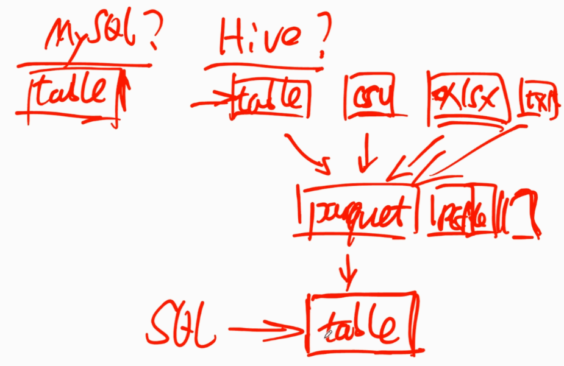
图中：parquet、RCfile是两种不同的中间格式。意思就是hive会源文件->中间格式->表，在表上面进行sql操作。

---
## metastore
和hive server一起跑或者分开跑，两个hive server可以共用同一个metastore。

---
## 支持的file format以及很多都是列存
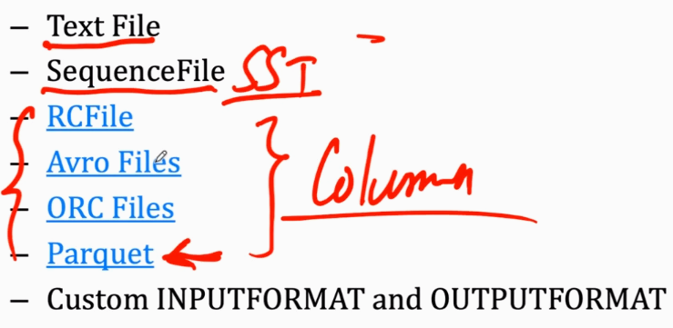
标Column都是列存

### 1. 行存：每一行的数据在存储中是连续的
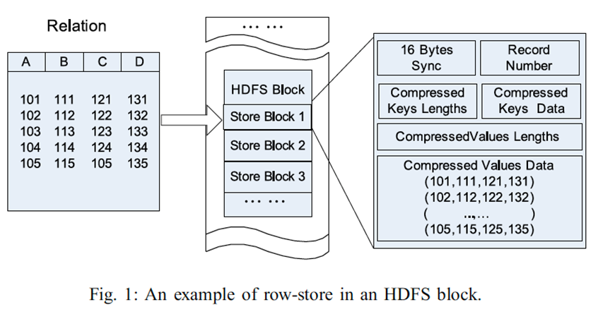

### 2. HBase列族
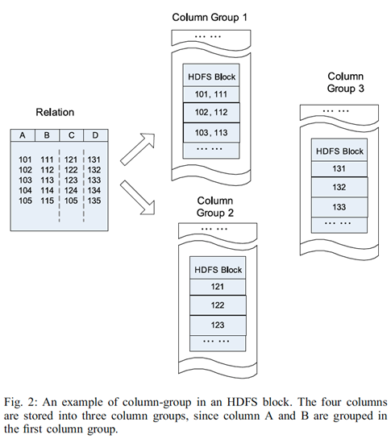
这还不是RCFile

### 3. RCFile列存
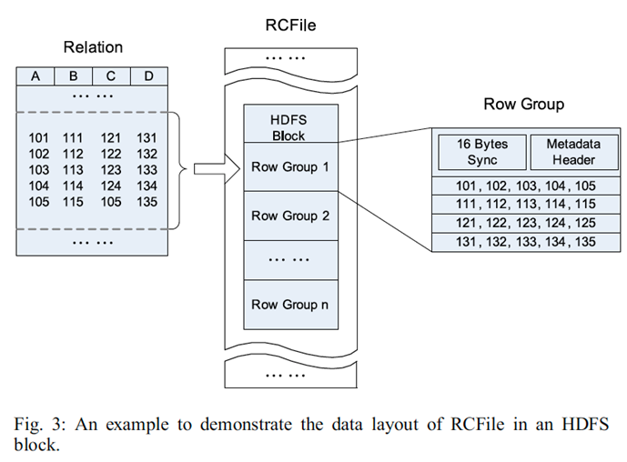
row group之间是行存，row group里面是列存

### 4. ORCFile
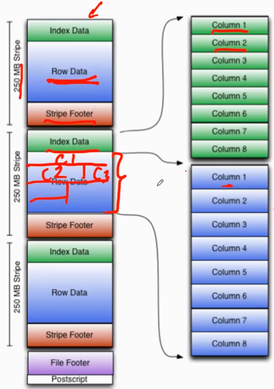
每个列如红笔标注依次存储，绿色记录每个column的起始offset

### parquet
类似的方式存储，但会做一些压缩。列之间的数据比较相似，可以采用类似事件序列数据的优化。

比如在重复数据较多时，可以采用bit vector来表示哪些行是某个数。需要权衡解压缩的时间。

# Flink
大互联网公司都在用的流式数据处理工具，处理有状态的事件流

## 流式数据处理的基本方法
在一个小的时间窗里执行批处理，当时间窗足够小的时候看起来像流式处理。
可以有边界，可以源源不断。可以实时，可以记录下来之后处理。需要支持有状态的处理，比如处理第3个数据需要用到处理前两个的结果。

## 状态怎么维护
内存或硬盘上，每个机器只能访问本地的。为了防止在内存或硬盘里丢失（为什么硬盘里会丢失），需要周期性增量性的快照。

### 如何做checkpoint
流里有一个栅栏事件，当栅栏事件进入operator，则会暂停当前流。当operator所有流栅栏都到达后，则记录状态。

**问题**：暂停会不会很浪费？
**回答**：在遇到一个栅栏时找另一个栅栏，并将未处理的部分，包括未输出的output buffer都记录在状态里。这样减少等待但是需要记录的状态更多
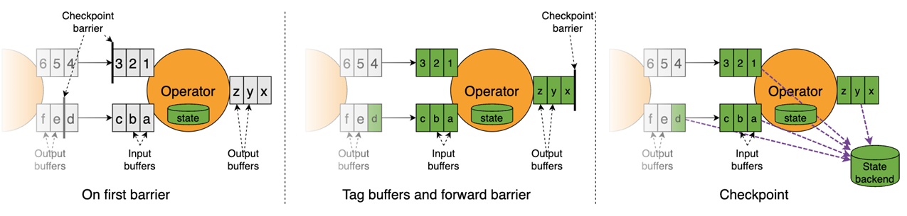

checkpoint存储使用RocksDB

### 记录的状态有哪些
1. 当前事件流处理到了哪个事件。
2. 如果一个operator处理多个流，则要记录每个流到了哪个数据，即记录栅栏的位置。
3. 最终的结果(sink)
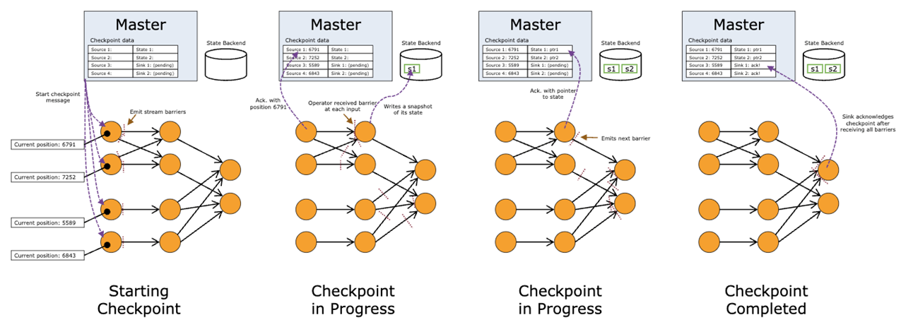

## 时间是怎么描述的
所有事件必须打上时间戳。有一些不同的时间概念，事件产生的时间，处理时间

### flink time-related feature

- 事件是什么时候产生的
- 水印事件，不代表任何语义动作，代表一个时间
- 处理的时候时间显得不一样，比如function同时处理两个event1，event2，分别有不同的t1，t2
- （无讲解）

### flink api
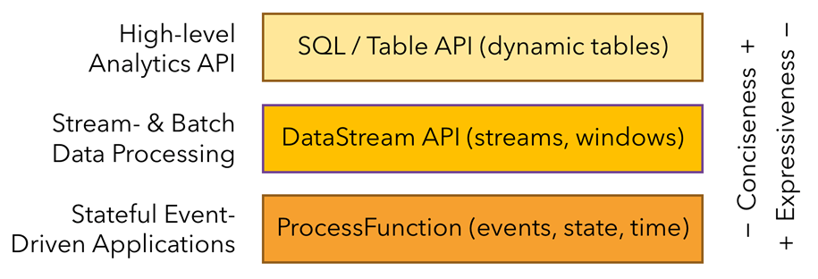
- 关心业务可以用最高层的，类似hive采用sql，数据以表呈现但是是动态表，数据更改非常快
- 不是最高层，想控制流的处理过程
- 想把流放大，流是一系列事件构成的，我直接操作处理函数

代码演示内容只贴了代码
#### 1. ProcessFunction api example
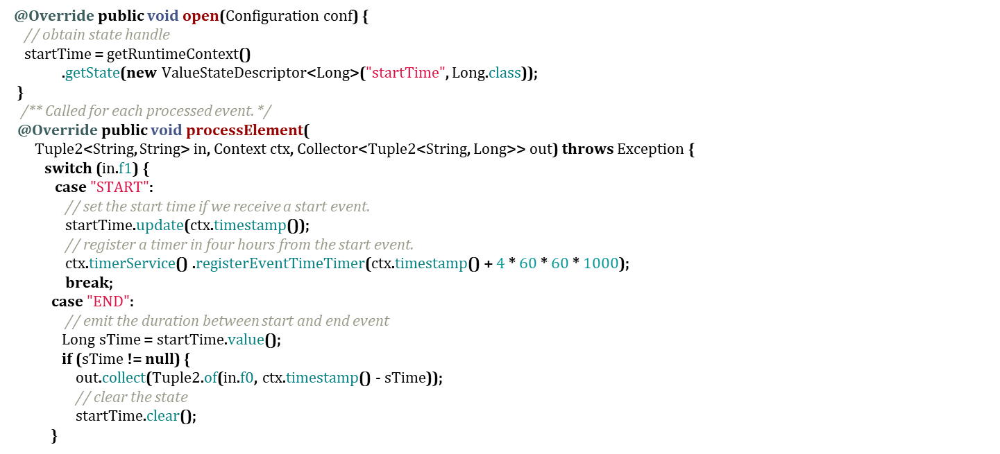
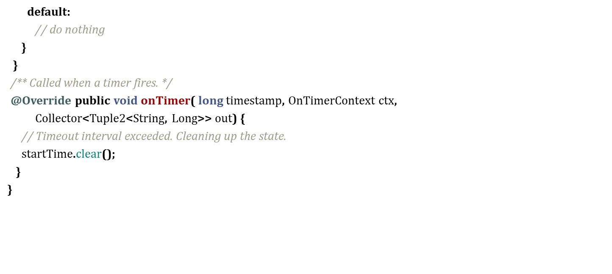

#### 2. DataStream api example
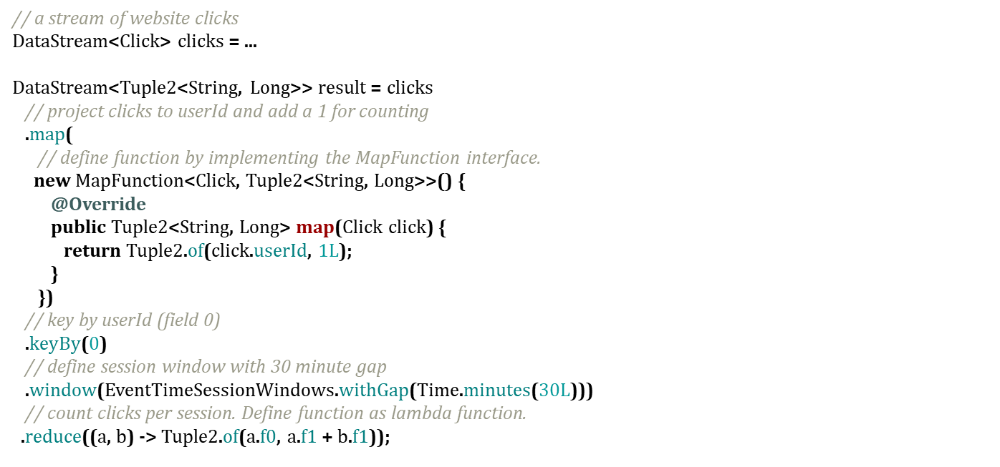

#### 3. SQL

点击事件30分钟分一组，最后得到每30分钟每个userId点击了几次

### watermark
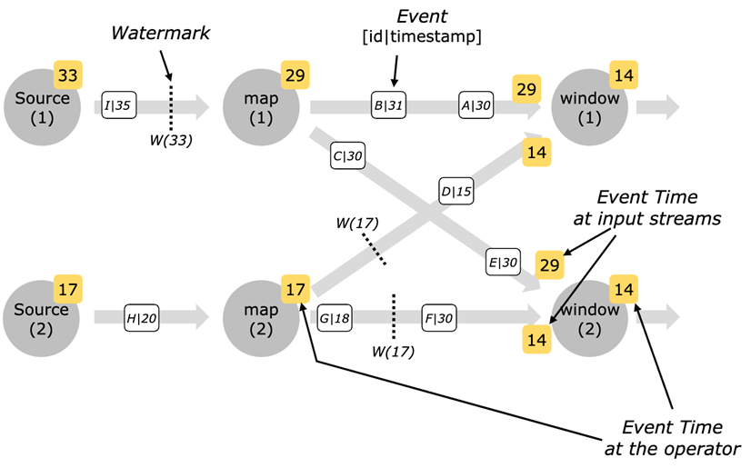
Source(1)处理过的时间是33，他只记录watermark时间，意味着这之前可能是乱序的，但33之前的我肯定是处理过的：即我之前可能处理过34，但是我不会没处理32。

同理Source(2)处理完的是17，map(1)处理完的是29，map(2)处理完的是17。

14和29同时到window(1)，则window处理完的只能是14。

### window
每固定时间作为一个时间窗：有可能有些时间窗很多，有些甚至没有

每固定个数的时间作为一个时间窗：遇到稀疏事件时，他的第一个事件就会显得不够实时

### architecture
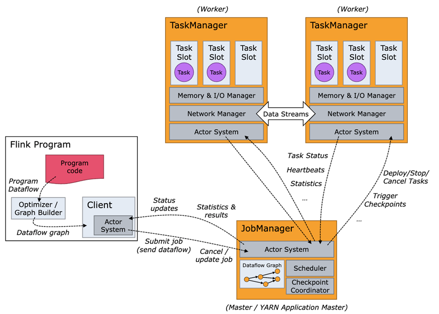
一个master多个worker，每个worker一个taskManager，一个taskManager多个task slot进程，一个task slot多个线程（spark、storm都是单一任务）