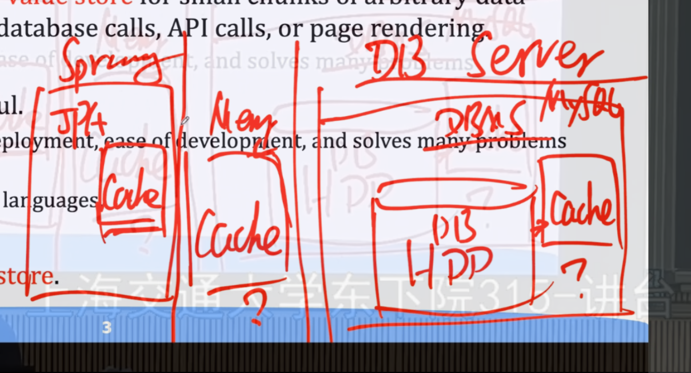
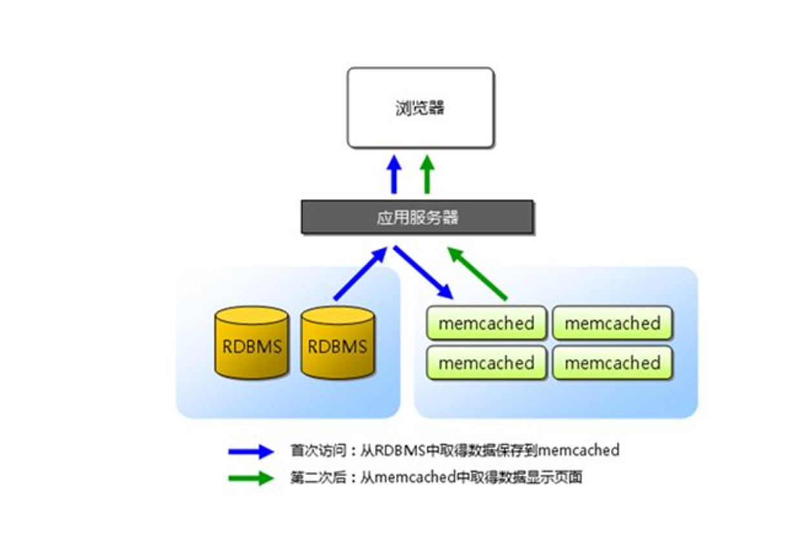
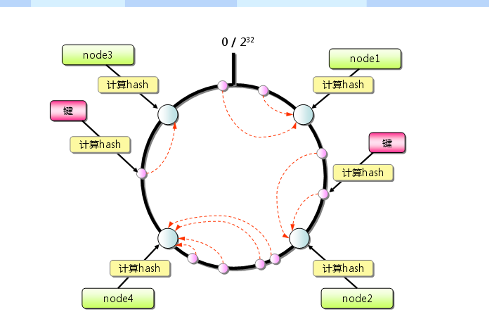
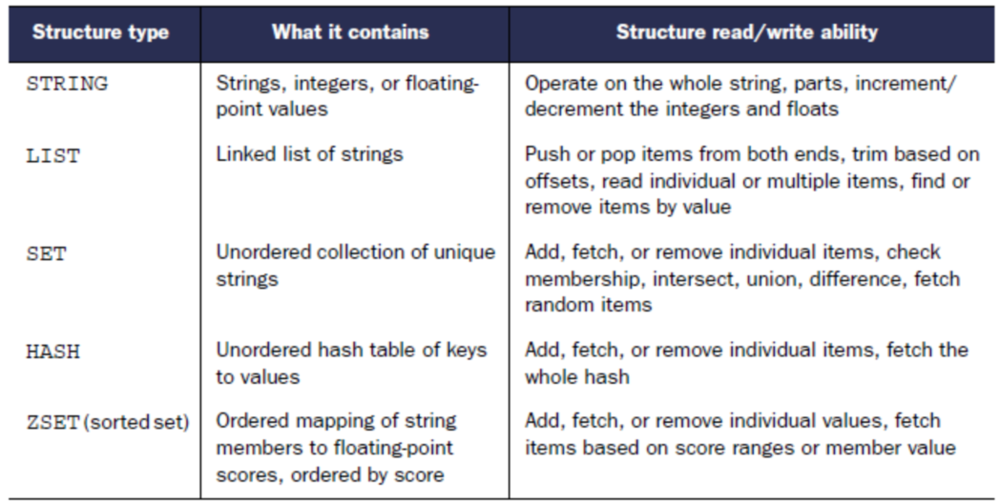

# 第 7 章 Cache

### 1. Memcache

- 在内存中，是 key-value 存储，key 自己设置，可在内存中直接访问到，从而避免读写硬盘速度过慢等问题。
- 问题：数据库本身也有缓存、springJPA 也有缓存，为啥还要加一个 memcache？
- 
- 回答：数据库缓存本身不可控，是根据执行的 SQL 语句来处理 cache，并且在数据库 server 上跑，和应用本身不在一起；而 springJPA 也可能不和 memcache 在一起。
- 所以用 memcache 的好处是，用跨进程而不是跨机器。如果 memcache 本身也要分开，那么可以做一个分布式集群，会远远大于 mysql 的缓存，可以放更多的数据。
- 除了放 mysql 的数据，还可以放 mongodb 的数据，甚至可以放 mongodb 和 mysql 两者合起来的数据，memcache 放的可以不是原始数据，所以会快，不需要二次 join 等操作。

- 逻辑：

- 缓存设计原则

  - 读写分离：经常读的数据适合放入缓存（如 memory cache），而频繁写的数据则不宜放入缓存。因为缓存的目的是为了提高读取效率，如果数据频繁写入，每次写入后都需要同步更新缓存和硬盘，会增加系统开销，降低缓存的性能优势。
  - 数据分类存储：对于一些包含多种属性的数据对象，应根据属性的读写特性进行拆分存储。例如，将相对静态、不常改变的属性（如书籍的 title、author 等基本信息）和动态变化的属性（如库存数量 stock）分开存储。

- Cacheable 注解与缓存逻辑

  - Cacheable 注解的作用：在 repository 层的方法上使用 Cacheable 注解，表示当调用该方法获取数据（如获取 book 对象）时，会将获取到的结果放入缓存中。这样，下次再请求相同的数据时，可以直接从缓存获取，而无需再次执行数据库查询或其他耗时操作，从而提高数据访问效率。
  - 缓存 key 的命名约定：为了在缓存中区分不同类型的对象，通常会为缓存 key 设定一定的命名规则。例如，对于 book 对象，缓存 key 以“books”开头，后面跟上具体的标识符（如 book 的主键）。这样做的好处是可以避免不同对象因主键相同而产生缓存 key 冲突。比如，不同表的主键都可能是整数递增的，通过在 key 前加上表名或对象类型前缀（如“persons”“books”等），可以明确区分不同对象的缓存数据。
  - 缓存逻辑流程：
    - 查询缓存：当调用带有 Cacheable 注解的方法（如 getByISBN 方法）时，首先会到缓存中查找对应的 key（以“books”开头加上 ISBN 值）。如果缓存中存在该 key 对应的数据，则直接返回缓存中的 book 对象。
    - 缓存未命中处理：如果缓存中找不到对应的数据，会执行方法体内的逻辑。例如，故意延迟 3 秒（通过让线程睡眠 3 秒来模拟耗时操作），然后根据传入的 ISBN 创建一个新的 book 对象。
    - 更新缓存：创建完新的 book 对象后，会将其放入缓存中，并且缓存的 key 会按照约定的规则（以“books”开头加上 ISBN 值）进行设置。这样，下次再请求相同 SBN 的 book 时，就可以直接从缓存中快速获取，而无需再次执行创建 book 对象的逻辑。

- 内存缓存的高效存储与管理

  - 内存划分与对象存储：
    - 内存划分：内存缓存被划分为多个不同大小的“chunk 内存块”，每个内存块可以存储特定大小范围的对象。例如，有 88 字节、112 字节、144 字节等不同大小的内存块，依次往上可以到更大的内存块。
    - 对象存储策略：当存储一个对象时，会根据对象的大小找到合适的内存块进行存储。如一个 100 字节的 book 对象会存储到 88 - 112 字节范围的内存块中；一个 288 字节的 person 对象会找到大于 288 字节的合适内存块存储。这种按大小划分和存储的方式可以提高内存的使用效率，避免空间浪费。
  - 命名空间与对象定位：
    - 命名空间分类：除了根据对象大小存储外，还会根据对象的类型（如 book、person 等）作为命名空间进行分类。例如，所有 book 对象都会存储在以“book”为命名空间的内存块中。
    - 快速定位对象：在查找对象时，首先根据对象大小快速定位到合适的内存块范围，然后在该范围内通过命名空间进一步精确定位到具体对象。这种组织方式使得内存使用效率高，查找速度快，就像在抽屉里分类放置大小不同的物品，需要时能快速找到。

- 分布式缓存的扩展与数据分布
  - 分布式缓存扩展：
    - 服务器数量变化：在分布式缓存系统中，可能会面临服务器数量变化的情况，如从 10 台服务器扩展到 11 台，或者从 10 台减少到 9 台。
    - 数据重新分布问题：如果简单地对服务器数量进行散列（如对 10 台服务器进行散列），当服务器数量发生变化时，所有对象的存储位置都会发生变化，这会导致缓存数据的大量重新分布，影响系统性能和数据一致性。
  - 合理的数据分布策略：
    - 使用 key 散列：一般会使用对象的 key（可以包含命名空间和对象 ID）进行散列，以确定对象在服务器集群中的存储位置。
    - 一致性散列等策略：为了解决服务器数量变化导致的数据重新分布问题，可以采用一致性散列等策略。一致性散列通过在服务器环上进行散列，当服务器数量变化时，只有部分对象的存储位置会发生变化，而不是所有对象，从而减少了数据迁移的开销，保证了分布式缓存系统的稳定性和高效性。
    - 

### 2. redis

- **Redis 数据类型**
  - 
  - 字符串（String）：可以存储字符串或数字。数字是以字符串形式存储的，适用于简单的键值对存储场景，如缓存单个值或对象的序列化字符串。
  - 哈希表（Hash）：存储键值对集合，类似于 Java 中的 Map。适用于存储对象的多个属性，如用户信息（用户名、密码、邮箱等），每个属性是一个键值对，通过对象的 ID 作为哈希表的 key 来访问。
  - 列表（List）：基于链表实现，可以存储多个元素的有序集合。适用于存储具有顺序关系的数据，如消息队列、评论列表等。列表中的元素可以重复。
  - 集合（Set）：存储无序的、不重复的元素集合。适用于存储不需要排序且元素唯一的数据，如用户的兴趣标签集合。
  - 有序集合（ZSet）：每个元素都有一个分数，可以根据分数进行排序。适用于存储带有权重的数据，如排行榜（按分数高低排序的用户列表）。
- **Redis 分布式特性**
  - 主从备份：Redis 支持主从备份机制，可以将数据从主节点复制到从节点。这样即使主节点出现故障，可以从从节点恢复数据，提高数据的可靠性和系统的可用性。备份可以在不同的机器上进行，也可以在同一台机器的不同内存空间进行。
  - 分布式缓存：在分布式系统中，Redis 可以部署在多台服务器上，形成一个分布式缓存集群。当集群中的某个节点缓存数据丢失时，可以通过其他节点进行数据恢复，保证缓存数据的一致性和完整性。
- **Redis 应用场景**
  - 缓存实体类：可以将应用程序中的实体类（如用户、书籍、商品等）缓存到 Redis 中。通过设置合适的 key（如实体类名称加 ID），可以快速从缓存中获取数据，减少对数据库的访问次数，提高系统性能。
  - 消息队列：Redis 可以作为消息队列使用。通过发布/订阅模式，可以在不同的应用程序组件之间传递消息。例如，一个服务可以向 Redis 发送消息，另一个服务可以监听并接收这些消息，实现异步通信。这种方式不需要依赖其他复杂的消息中间件，简化了系统架构。
- **Redis 操作与配置**
  - Spring Data Redis：Spring 提供了 RedisTemplate 类，用于简化 Redis 的操作。通过 RedisTemplate，可以方便地执行各种 Redis 命令，如 get、set、hget、hset 等。在使用时，需要注意将对象序列化为字符串存储到 Redis 中，以及从 Redis 中获取字符串后反序列化为对象。
  - 通用操作与数据访问网关：为了避免为每个实体类编写重复的缓存操作代码，可以设计一个通用的数据访问网关。将实体类类型作为参数传递给网关方法，实现统一的缓存操作逻辑，提高代码的复用性和可维护性。
