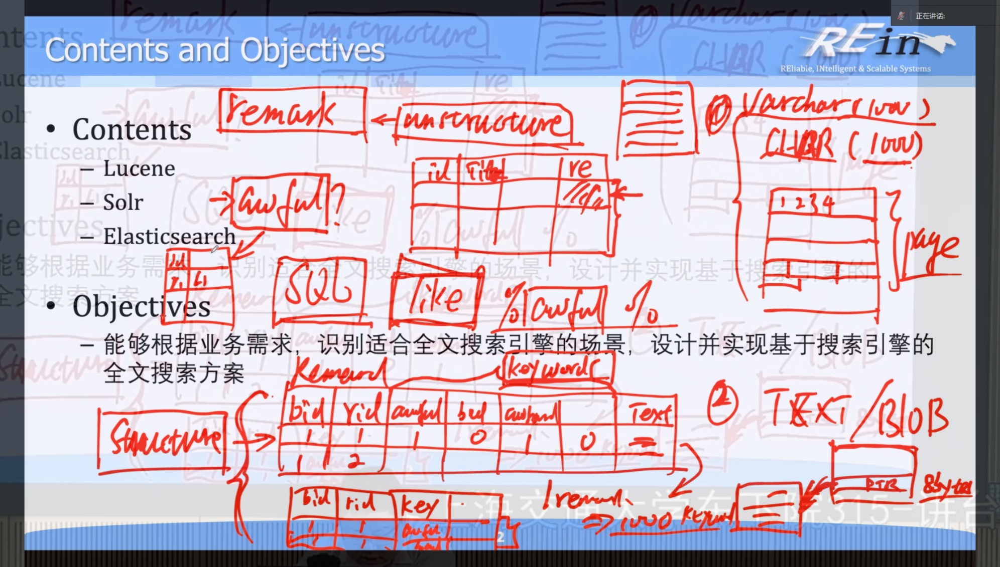

# 第 8 章 Full-text Searching

**_（下面是这一坨讲解提取出来的知识点）_**

- **_数据存储方案（如书评）_**
  - **固定长度字段（定长字段）存储**
    - 定义：这种方案是将书评以固定长度的字段存储在数据库表中。例如，设定字段长度为 1000 个字符。
    - 优点：在内存中存储整齐。因为每个字段的长度都是固定的，所以数据库在内存中的布局非常规整，方便管理和访问。例如，数据库系统可以很容易地计算出每个字段在内存中的起始位置，就像一个整齐排列的书架，每本书（字段）的厚度都一样，方便查找。
    - 缺点：浪费存储空间。如果书评内容较短，比如只有“很好”两个字，但字段长度设定为 1000 个字符，那么剩下的 998 个字符位置就会被浪费。这就像是一个大房间，只放了一张小桌子，大部分空间都没有被利用。
  - **可变长度字段（变长字段）存储**
    - 定义：使用 VARCHAR 这种可变长度的字段类型来存储书评。可以指定一个上限长度，例如 1000 个字符，但在存储时会根据实际内容的长度来存储，并记录长度和偏移量。
    - 优点：存储紧凑。书评内容会紧密排列存储，不会像固定长度字段那样浪费空间。例如，一个很长的书评后面紧接着一个很短的书评，它们在数据库文件中会紧密相连，就像不同厚度的书紧密地放在书架上，充分利用空间。
    - 缺点：管理相对复杂。数据库需要记录每个字段的长度和偏移量，这就增加了管理的复杂性。就像管理一个不规则排列的书架，需要记住每本书的厚度和位置才能找到它。
- **外部存储（如 TEXT 或 BLOB 类型）**

  - 定义：将书评作为一个外部文件存储，数据库表中只存储一个指向该文件的指针。
  - 优点：提高主表的存储效率。因为书评字段只占用一个指针的大小（例如在 64 位机器上是 8 个字节），这样主表可以存储更多的记录。这就像是在一个小盒子里只放一张指向大箱子的标签，小盒子就可以放更多的标签，方便管理更多的大箱子（书评内容）。
  - 缺点：需要额外的读盘操作。当需要读取书评内容时，不仅要读取主表记录，还要通过指针去读取外部文件，这就增加了读取时间。就像要找到一本书的内容，不仅要找到标签，还要根据标签去另一个地方找到书，多了一步操作。

- **_关于 SQL LIKE 语句_**
  - 通配符的使用：在 SQL 中，LIKE 操作符常用于模糊查询，配合通配符可以实现多种匹配模式。其中，%通配符代表零个、一个或多个字符，常用于匹配不确定长度的字符串，如 LIKE '%awful%'可匹配包含“awful”子字符串的所有记录。
    \_通配符代表一个字符，用于匹配特定位置的单个字符，如 LIKE '\_o%'可匹配第二个字符为“o”的字符串。
  - 性能问题：使用 LIKE 语句尤其是 LIKE '%value%'这种模式时，会导致数据库进行全表扫描，即需要读取表中的每一条记录来查找包含特定子字符串的记录，这使得查询速度非常慢，尤其是当表中记录数较多时，性能会显著下降。
- **_ 关于数据存储与结构化_**

  - **非结构化数据存储的弊端**：将包含关键词的字段（如 Remark）直接作为一个字段存储在数据库表中，属于非结构化存储。这种方式在查询时，无法快速定位包含特定关键词的记录，因为数据库需要逐条读取记录并搜索子字符串，效率低下。
  - **结构化存储方案**：可以将 Remark 中的关键词提取出来，单独存储在一个表中，该表包含 book ID、remark ID、关键词等字段。这样，每一条 Remark 对应多行记录，每行记录表示一个关键词及其相关信息。虽然这种方式在存储上可能会导致表的尺寸较大，尤其是当 Remark 文本较长、包含关键词较多时，但有利于后续的查询操作。

- 搜索引擎的工作原理

  - 索引（Indexing）：爬取完网页后，搜索引擎会对网页进行整理，提取关键词，去除重复内容，判断质量等，创建索引。索引分为正向索引和倒排索引两种主要方式。
  - 排名（Ordering）：当用户输入查询词后，搜索引擎会使用预先归纳编排好的索引查找匹配页面，按排名因素排好序，再在搜索结果页面将内容展示给用户。排名因素包括相关性、权威性、时效性、重要性、丰富度和受欢迎程度等。

- 排序规则

  - 相似度：衡量用户输入的关键词与文档内容的相似程度。如果关键词是一个短语或句子，相似度的计算会更复杂，通常会考虑关键词在文档中的位置和出现频率。
  - 频率：关键词在文档中出现的次数。出现次数越多，文档的相关性可能越高，因此在排序时会优先考虑。
  - 索引的维护
    **增量式更新**：搜索引擎需要能够增量式地更新索引，而不是每次有新内容时都重新构建整个索引。这样可以提高索引的更新效率，减少资源消耗。

- **Lucene**

  - 文档读取
    Lucene 将每篇文档视作一个 Document 对象，每个 Document 包含若干个 Field 对象。例如，一个新闻文章的 Document 对象可能包含标题、正文、日期等 Field。Field 可以配置为不同类型：
    TextField：文本字段，可以分词和索引。
    StringField：不分词的字符串字段，适合唯一标识符。
    StoredField：仅存储，不用于索引（例如文档 ID）。
  - 分析和分词
    在文档被加载为 Document 对象后，Lucene 会通过分析器（Analyzer）将文本内容转换为一系列词元。这一步骤是索引构建的核心环节，因为它将非结构化的文本转化为结构化的数据，方便构建倒排索引。
    - 分词器（Tokenizer）：Lucene 内置了多种分词器，如 StandardAnalyzer、WhitespaceAnalyzer 等，适用于不同的语言和应用场景。
    - 词元过滤（Token Filter）：分词后，Lucene 会通过词元过滤器进一步处理词元，例如去除停用词（“the”、“is”等）或进行词干提取（将“running”变为“run”）。
  - **反向索引（Inverted Index）构建**
    - 反向索引是 Lucene 实现高效全文检索系统的核心数据结构，它将每个词元映射到包含该词元的文档中，并记录词元在文档中的位置等信息，用于快速定位关键词所在的文档。
    - 词典（Term Dictionary）：倒排索引中，每个唯一的词（Term）都会存入词典中。词典用于存储所有被索引的词，并且按字典顺序排列。
    - 倒排表（Posting List）：倒排表记录了包含该词的文档 ID 以及该词在每篇文档中的位置信息。倒排表的存储结构可以显著优化查询速度。

> **正向索引（Forward Index）和反向索引（Inverted Index）** 是两种不同的文本索引技术，用于管理和加速文本数据的检索。它们在搜索引擎和信息检索系统中起着关键作用，并在不同的方面具有不同的优势和用途。
> **1. 正向索引（Forward Index）：**
>
> - 正向索引是一种按文档来组织和存储文本数据的索引方式。每个文档都有一个对应的索引项，这个索引项包含了文档中的所有信息，通常以文档的标识符（如文档 ID）为索引的键。
> - 正向索引适合于需要按文档进行检索的场景，例如在文档管理系统中查找特定文档或根据文档属性进行过滤和排序。
> - 缺点是在处理大量文本数据时，正向索引可能需要大量的存储空间，因为每个文档都需要一个完整的索引项。
>
> **2. 反向索引（Inverted Index）：**
>
> - 反向索引是一种按单词或词组来组织和存储文本数据的索引方式。它**将文本数据中的每个单词或词组与包含它们的文档关联起来**，以及它们在文档中的位置。
> - 反向索引适用于全文搜索和信息检索系统，因为它允许根据关键词快速查找包含这些关键词的文档。这种索引方式在搜索引擎中得到广泛应用。
> - 反向索引通常占用相对较少的存储空间，因为它不需要存储完整的文档内容，只需存储单词或词组的位置信息和文档标识符。
>
> **比较：**
>
> - 正向索引适用于需要按文档检索的应用，例如文档管理系统或内容展示。
> - 反向索引适用于需要**全文搜索和关键词检索的应用**，例如搜索引擎和信息检索系统。
> - 正向索引需要更多的存储空间，但在访问特定文档时速度较快。
> - 反向索引占用较少的存储空间，但在全文搜索和关键词检索时速度更快。
>
> 通常，搜索引擎会结合使用正向索引和反向索引，以满足不同的检索需求，并提供高效的搜索体验。正向索引用于快速获取文档的详细信息，而反向索引用于高效地找到包含查询关键词的文档。

### Core Indexing Classes 核心索引类

- **IndexWriter：**

  - `IndexWriter` 是索引创建和维护的核心类。它负责将文档添加到索引、更新索引、删除文档以及优化索引等操作。`IndexWriter` 是在索引建立和更新过程中的主要接口之一。

- **Directory：**

  - `Directory` 是索引文件的存储和管理抽象。它定义了索引文件的位置和访问方式，可以是基于文件系统的目录，也可以是内存中的数据结构。`Directory` 提供了对索引文件的读写操作，使得索引可以被持久化存储和检索。

- **Analyzer：**

  - `Analyzer` 是文本分析的关键组件。它定义了如何将文本数据分割成单词或词组，进行词干化、去除停用词等文本处理操作。正确选择和配置适当的分析器对于索引的质量和性能至关重要。

- **Document：**

  - `Document` 表示索引中的一个文档。文档通常由一组字段（`Field`）组成，每个字段包含了文档的一部分信息，如标题、正文、作者等。`Document` 用于将文本数据添加到索引。

- **Field：**
  - `Field` 是文档中的一个字段或属性。它包含了字段的名称、值以及用于指定如何处理该字段的配置选项。字段可以是文本、数字、日期等不同类型的数据，根据需要进行索引和检索。

这些核心索引类是构建文本搜索引擎和信息检索系统的基础，它们协同工作以创建、管理和查询索引，以便用户能够高效地检索和获取相关文档。

- **查询和搜索**
  查询和搜索过程包括以下步骤：
  解析查询：将用户输入的查询字符串转换成一系列的词元（Term）。
  构建查询对象：使用 QueryParser 或手动构建 Query 对象。
  执行查询：使用 IndexSearcher 执行查询，返回匹配的文档列表。
  结果排序：根据相关性评分对结果进行排序。
- **相似度计算**
  Lucene 使用 TF-IDF（Term Frequency-Inverse Document Frequency）算法计算文档的相关性评分。TF-IDF 算法考虑了词频（TF）和逆文档频率（IDF）两个因素：
  TF：词频，表示关键词在文档中出现的次数。
  IDF：逆文档频率，表示关键词在所有文档中出现的频率的倒数。

## Solr 和 Elasticsearch

1. Solr
   Solr 是基于 Lucene 构建的全文搜索引擎，提供了分布式索引、负载均衡、主从备份等功能。Solr 通过封装 Lucene，简化了索引和搜索的复杂性，适用于大规模数据的全文检索。
   Avatar
   Lucene 原理及应用
2. Elasticsearch
   Elasticsearch 是一个基于 Lucene 构建的分布式搜索引擎，支持实时搜索、多租户、高可用性等功能。Elasticsearch 通过分片和副本机制，提高了索引和搜索的性能和可靠性。
   例如，Elasticsearch 的基本概念包括：
   集群：一个或多个节点的集合，提供跨所有节点的集合索引和搜索功能。
   索引：不同类型的文档和文档属性的集合。
   类型/映射：共享同一索引中存在的一组公共字段的文档的集合。
   文档：以 JSON 格式定义的特定方式的字段集合。
   碎片：索引被水平细分为碎片，每个碎片包含文档的所有属性。
   副本：Elasticsearch 允许用户创建其索引和分片的副本，提高数据的可用性和搜索性能。
